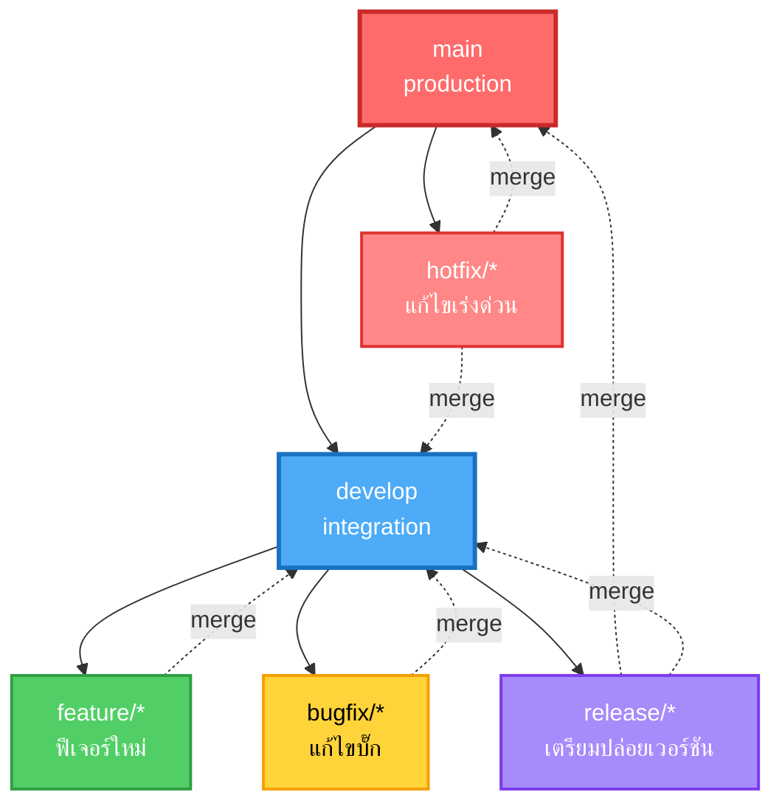
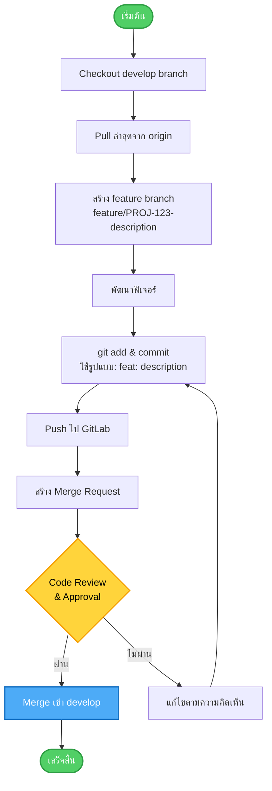
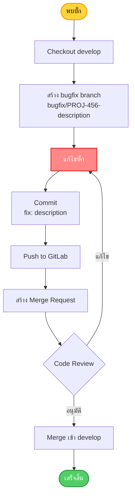
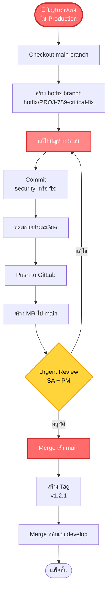
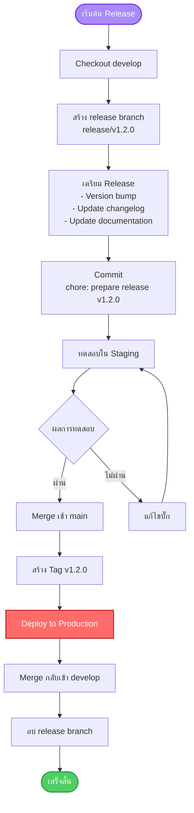
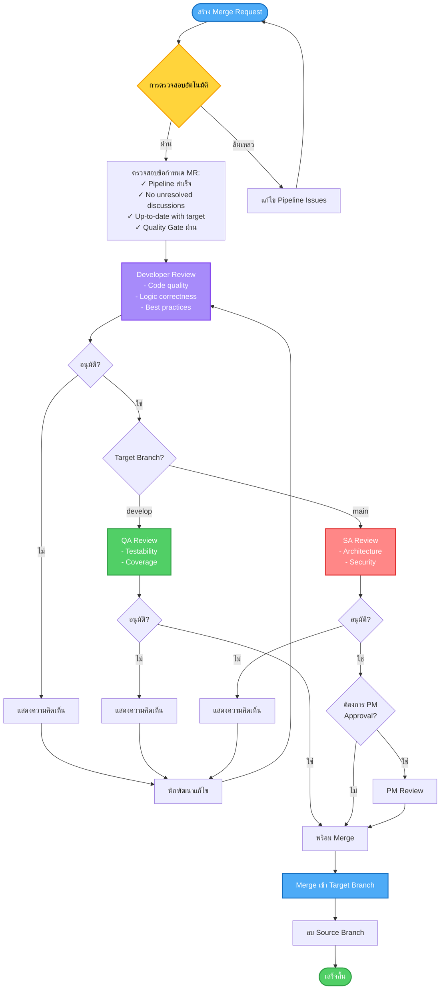

# Git Branching Model

## Overview

เอกสารนี้อธิบายแนวทางการใช้ Git Branching Model ที่ AIDC Tech ใช้สำหรับการพัฒนาซอฟต์แวร์อย่างเป็นระบบและปลอดภัย เราใช้ Git Flow เป็นพื้นฐานในการจัดการ branches และการพัฒนา

เอกสารนี้อ้างอิงจาก Secure Software Development Policy และปรับให้เหมาะกับการทำงานในองค์กร

---

## Git Flow Overview

Git Flow เป็นกลยุทธ์การแตก branch ที่ช่วยให้การพัฒนาซอฟต์แวร์เป็นระบบ มีการแยก branch สำหรับฟีเจอร์ การแก้ไขบั๊ก และ production releases อย่างชัดเจน

### Branch Structure



---

## Branch Types

### ตารางสรุป Branch Types

| ประเภท Branch | วัตถุประสงค์ | Protected | ใครสามารถ Merge | รูปแบบการตั้งชื่อ |
|--------------|-------------|-----------|------------------|------------------|
| **main** | โค้ด Production | ✓ | PM, SA | `main` |
| **develop** | Integration branch | ✓ | SA, Dev Lead | `develop` |
| **feature/** | ฟีเจอร์ใหม่ | ✗ | Dev | `feature/TICKET-123-description` |
| **bugfix/** | แก้ไขบั๊ก | ✗ | Dev | `bugfix/TICKET-123-description` |
| **hotfix/** | แก้ไขเร่งด่วน | ✗ | SA, Dev Lead | `hotfix/TICKET-123-description` |
| **release/** | เตรียมปล่อยเวอร์ชัน | ✗ | SA, PM | `release/v1.2.3` |

---

## 1. Main Branch

### วัตถุประสงค์
- เก็บโค้ดที่พร้อม deploy ไป production
- ทุก commit ใน main คือเวอร์ชันที่ stable และผ่านการทดสอบแล้ว

### กฎการใช้งาน

✅ **ควรทำ:**
- Merge เฉพาะจาก `release/*` หรือ `hotfix/*` branches
- สร้าง Git tag สำหรับทุก release (เช่น `v1.2.3`)
- Deploy ไป production เมื่อมีการ merge เข้า main

✗ **ไม่ควรทำ:**
- Commit โดยตรงไปยัง main
- Merge จาก feature branches โดยตรง
- Force push ไปยัง main (ห้ามเด็ดขาด)

### การป้องกัน (Protected Branch)
- Push: Maintainer เท่านั้น
- Merge: Maintainer + SA เท่านั้น
- Force Push: ✗ ห้าม
- ต้องมีการอนุมัติจาก SA และ PM

### ตัวอย่างการใช้งาน

```bash
# ✅ ถูกต้อง - Merge จาก release branch
git checkout main
git merge --no-ff release/v1.2.0
git tag -a v1.2.0 -m "Release version 1.2.0"
git push origin main --tags

# ❌ ผิด - ห้าม commit โดยตรง
git checkout main
git commit -m "quick fix"  # ❌ อย่าทำแบบนี้!
```

---

## 2. Develop Branch

### วัตถุประสงค์
- Integration branch สำหรับการรวมฟีเจอร์ต่างๆ
- ใช้สำหรับการพัฒนาต่อเนื่อง (ongoing development)
- ทดสอบการทำงานร่วมกันของฟีเจอร์ต่างๆ

### กฎการใช้งาน

✅ **ควรทำ:**
- Merge จาก `feature/*` และ `bugfix/*` branches
- รัน automated tests ก่อน merge
- Deploy ไป staging/dev environment สำหรับการทดสอบ

✗ **ไม่ควรทำ:**
- Commit โดยตรงไปยัง develop (ยกเว้นกรณีจำเป็น)
- Merge code ที่ยังไม่ผ่าน tests
- Force push (ยกเว้นกรณีพิเศษและต้องแจ้งทีม)

### การป้องกัน (Protected Branch)
- Push: Developer เท่านั้น
- Merge: Developer ขึ้นไป
- Force Push: ✗ ห้าม
- ต้องผ่าน CI/CD pipeline

### ตัวอย่างการใช้งาน

```bash
# อัพเดท develop branch
git checkout develop
git pull origin develop

# Merge feature branch เข้า develop
git merge --no-ff feature/PROJ-123-user-profile
git push origin develop
```

---

## 3. Feature Branches

### วัตถุประสงค์
- พัฒนาฟีเจอร์ใหม่
- แยกการพัฒนาออกจาก develop branch
- ทำให้การทำงานหลายฟีเจอร์พร้อมกันเป็นไปได้

### รูปแบบการตั้งชื่อ

```
feature/<TICKET-ID>-<short-description>
```

**ตัวอย่าง:**
- `feature/PROJ-123-user-authentication`
- `feature/PROJ-456-payment-integration`
- `feature/PROJ-789-email-notification`

### Workflow: การพัฒนาฟีเจอร์



### ขั้นตอนการทำงาน

#### 1. สร้าง Feature Branch

```bash
# 1. อัพเดท develop branch
git checkout develop
git pull origin develop

# 2. สร้าง feature branch ใหม่
git checkout -b feature/PROJ-123-user-authentication

# 3. ตรวจสอบว่าอยู่บน branch ที่ถูกต้อง
git branch
```

#### 2. พัฒนาฟีเจอร์

```bash
# 1. เขียนโค้ด
# ... code your feature ...

# 2. ตรวจสอบการเปลี่ยนแปลง
git status
git diff

# 3. รัน tests locally
npm test
npm run lint

# 4. รัน SonarLint (ถ้ามี)
# ตรวจสอบ code quality ก่อน commit
```

#### 3. Commit การเปลี่ยนแปลง

```bash
# Stage changes
git add src/auth/

# Commit with meaningful message
git commit -m "feat(auth): add OAuth2 authentication support

Implement OAuth2 login flow using Google and GitHub providers.
Add refresh token mechanism for enhanced security.

Refs #123"
```

#### 4. Push และสร้าง Merge Request

```bash
# Push feature branch
git push -u origin feature/PROJ-123-user-authentication

# จากนั้นสร้าง Merge Request ใน GitLab UI
# หรือใช้ GitLab CLI
gl mr create --title "feat(auth): add OAuth2 authentication" \
  --description "Implements OAuth2 authentication as per PROJ-123" \
  --source-branch feature/PROJ-123-user-authentication \
  --target-branch develop
```

#### 5. อัพเดท Feature Branch (ถ้า develop มีการเปลี่ยนแปลง)

```bash
# ถ้า develop branch มีการ update ระหว่างพัฒนา
git checkout develop
git pull origin develop

git checkout feature/PROJ-123-user-authentication
git rebase develop

# หรือใช้ merge (ถ้า prefer merge over rebase)
git merge develop

# Push การเปลี่ยนแปลง
git push origin feature/PROJ-123-user-authentication --force-with-lease
```

### Best Practices สำหรับ Feature Branches

✅ **ควรทำ:**
- ตั้งชื่อที่มีความหมายและอ้างอิง ticket/issue
- Commit บ่อยๆ ด้วย messages ที่ชัดเจน
- รัน tests ก่อน push
- Rebase จาก develop เป็นประจำเพื่อหลีกเลี่ยง merge conflicts
- ลบ branch หลัง merge เข้า develop แล้ว
- Keep branch small and focused (Single Responsibility)

✗ **ไม่ควรทำ:**
- พัฒนาหลายฟีเจอร์ใน branch เดียว
- ปล่อยให้ branch อยู่นานเกินไปโดยไม่ merge
- Commit secrets หรือ sensitive data
- ละเลยการทำ code review

---

## 4. Bugfix Branches

### วัตถุประสงค์
- แก้ไขบั๊กที่พบใน develop branch
- แยกการแก้ไขออกจากการพัฒนาฟีเจอร์

### รูปแบบการตั้งชื่อ

```
bugfix/<TICKET-ID>-<short-description>
```

**ตัวอย่าง:**
- `bugfix/PROJ-456-fix-login-timeout`
- `bugfix/PROJ-789-resolve-null-pointer`
- `bugfix/PROJ-234-payment-error-handling`

### Workflow: การแก้ไขบั๊ก



### ขั้นตอนการทำงาน

```bash
# 1. สร้าง bugfix branch จาก develop
git checkout develop
git pull origin develop
git checkout -b bugfix/PROJ-456-fix-login-timeout

# 2. แก้ไขบั๊ก
# ... fix the bug ...

# 3. เพิ่ม/อัพเดท unit tests เพื่อป้องกันบั๊กซ้ำ
# ... write tests ...

# 4. รัน tests
npm test

# 5. Commit
git add .
git commit -m "fix(auth): resolve login timeout issue

Fixed race condition that caused timeouts during peak hours.
Added retry mechanism with exponential backoff.

Fixes #456"

# 6. Push และสร้าง MR
git push -u origin bugfix/PROJ-456-fix-login-timeout
```

### Best Practices

✅ **ควรทำ:**
- เพิ่ม unit tests เพื่อป้องกันบั๊กเกิดซ้ำ (regression)
- อธิบาย root cause ใน commit message
- ทดสอบ fix อย่างละเอียดก่อน merge
- Reference issue/ticket ที่เกี่ยวข้อง

✗ **ไม่ควรทำ:**
- แก้ไขบั๊กโดยไม่เขียน tests
- รวมการพัฒนาฟีเจอร์ใหม่เข้าไปด้วย
- ละเลยการหา root cause

---

## 5. Hotfix Branches

### วัตถุประสงค์
- แก้ไขปัญหาร้ายแรงใน production อย่างเร่งด่วน
- Bypass normal development flow เพื่อความรวดเร็ว

### รูปแบบการตั้งชื่อ

```
hotfix/<TICKET-ID>-<short-description>
```

**ตัวอย่าง:**
- `hotfix/PROJ-999-critical-security-fix`
- `hotfix/PROJ-888-payment-gateway-down`
- `hotfix/PROJ-777-data-corruption-fix`

### เมื่อไหร่ควรใช้ Hotfix

✅ **ใช้ Hotfix เมื่อ:**
- ช่องโหว่ด้านความปลอดภัยที่ร้ายแรง (Critical/High severity)
- Production down หรือไม่สามารถใช้งานได้
- Data corruption หรือ data loss
- ปัญหาที่กระทบต่อ business operations อย่างร้ายแรง

✗ **ไม่ควรใช้ Hotfix สำหรับ:**
- บั๊กเล็กน้อยที่ไม่ critical
- ฟีเจอร์ใหม่
- ปัญหาที่สามารถรอ release cycle ปกติได้

### Workflow: Hotfix



### ขั้นตอนการทำงาน

#### 1. สร้าง Hotfix Branch

```bash
# 1. Checkout main branch (production code)
git checkout main
git pull origin main

# 2. สร้าง hotfix branch
git checkout -b hotfix/PROJ-999-critical-security-fix

# 3. ตรวจสอบ current version
git describe --tags --abbrev=0  # ตัวอย่าง: v1.2.0
```

#### 2. แก้ไขปัญหา

```bash
# 1. แก้ไขปัญหา
# ... fix the critical issue ...

# 2. เขียน/อัพเดท tests
# ... write tests ...

# 3. รัน full test suite
npm test
npm run e2e

# 4. ทดสอบใน local environment
# ตรวจสอบว่าการแก้ไขไม่ทำให้เกิดปัญหาใหม่
```

#### 3. Commit และ Push

```bash
# Commit with appropriate type (security or fix)
git add .
git commit -m "security: fix SQL injection vulnerability in search

Replaced string concatenation with parameterized queries
to prevent SQL injection attacks.

Impact: Critical
Severity: CVSS 9.1

Fixes #999"

# Push hotfix branch
git push -u origin hotfix/PROJ-999-critical-security-fix
```

#### 4. Create Merge Request และ Deploy

```bash
# 1. สร้าง MR ไปยัง main branch (ผ่าน GitLab UI หรือ CLI)
# 2. รอการ review จาก SA และ PM (urgent review)
# 3. Merge เข้า main หลังได้รับอนุมัติ

# 4. สร้าง Git tag (version bump)
git checkout main
git pull origin main
git tag -a v1.2.1 -m "Hotfix: Critical security vulnerability"
git push origin v1.2.1

# 5. Merge hotfix กลับเข้า develop
git checkout develop
git pull origin develop
git merge --no-ff hotfix/PROJ-999-critical-security-fix
git push origin develop

# 6. ลบ hotfix branch
git branch -d hotfix/PROJ-999-critical-security-fix
git push origin --delete hotfix/PROJ-999-critical-security-fix
```

### Best Practices

✅ **ควรทำ:**
- แจ้งทีมทันทีเมื่อมีการสร้าง hotfix
- ทดสอบอย่างละเอียดแม้จะเร่งด่วน
- เขียน post-mortem document หลัง hotfix
- Merge กลับเข้า develop ทันทีหลัง merge เข้า main
- สื่อสารกับ stakeholders เกี่ยวกับ hotfix

✗ **ไม่ควรทำ:**
- รีบเร่งจนข้าม testing
- ละเลยการ document สาเหตุและวิธีแก้ไข
- ลืม merge กลับเข้า develop

---

## 6. Release Branches

### วัตถุประสงค์
- เตรียมการสำหรับ production release
- Finalize version numbers, update changelogs
- Final testing และ bug fixes

### รูปแบบการตั้งชื่อ

```
release/<version>
```

**ตัวอย่าง:**
- `release/v1.2.0`
- `release/v2.0.0`
- `release/v1.3.5`

### Workflow: Release Process



### ขั้นตอนการทำงาน

#### 1. สร้าง Release Branch

```bash
# 1. Checkout develop branch
git checkout develop
git pull origin develop

# 2. สร้าง release branch
git checkout -b release/v1.2.0

# 3. Push release branch
git push -u origin release/v1.2.0
```

#### 2. เตรียม Release

```bash
# 1. อัพเดท version numbers
# package.json, version files, etc.
npm version 1.2.0 --no-git-tag-version

# 2. Generate และอัพเดท CHANGELOG.md
# ใช้ conventional-changelog หรือเขียนเอง
npx conventional-changelog -p angular -i CHANGELOG.md -s

# 3. อัพเดทเอกสาร
# README.md, API docs, migration guides, etc.

# 4. Commit การเปลี่ยนแปลง
git add .
git commit -m "chore: prepare release v1.2.0

- Bump version to 1.2.0
- Update CHANGELOG.md
- Update documentation"

git push origin release/v1.2.0
```

#### 3. Testing ใน Staging

```bash
# Deploy ไป staging environment
# รัน full test suite
npm test
npm run e2e
npm run integration-test

# Manual testing
# - Smoke testing
# - Regression testing
# - User acceptance testing (UAT)
```

#### 4. Bug Fixes (ถ้าจำเป็น)

```bash
# ถ้าพบบั๊กใน release branch
# แก้ไขโดยตรงใน release branch

git checkout release/v1.2.0

# แก้ไขบั๊ก
# ... fix bugs ...

git add .
git commit -m "fix: resolve issue found in UAT

Fixes #567"

git push origin release/v1.2.0

# ทดสอบอีกครั้ง
npm test
```

#### 5. Merge เข้า Main และ Deploy

```bash
# 1. สร้าง MR ไปยัง main
# รอการ review และอนุมัติจาก SA และ PM

# 2. Merge เข้า main
git checkout main
git pull origin main
git merge --no-ff release/v1.2.0
git push origin main

# 3. สร้าง Git tag
git tag -a v1.2.0 -m "Release version 1.2.0

Features:
- OAuth2 authentication
- Payment gateway integration
- Email notifications

Bug fixes:
- Fixed login timeout
- Resolved null pointer exceptions

See CHANGELOG.md for full details"

git push origin v1.2.0

# 4. Deploy to production
# ใช้ CI/CD pipeline หรือ manual deployment
```

#### 6. Merge กลับเข้า Develop

```bash
# Merge release branch กลับเข้า develop
git checkout develop
git pull origin develop
git merge --no-ff release/v1.2.0
git push origin develop

# ลบ release branch
git branch -d release/v1.2.0
git push origin --delete release/v1.2.0
```

### Best Practices

✅ **ควรทำ:**
- สร้าง release branch เมื่อฟีเจอร์สำหรับ release นั้นๆ ครบแล้ว
- ทำเฉพาะ bug fixes และ release preparation
- ทดสอบอย่างละเอียดใน staging
- อัพเดท CHANGELOG.md และเอกสารให้ครบถ้วน
- สื่อสารกับทีมเกี่ยวกับกำหนดการ release

✗ **ไม่ควรทำ:**
- เพิ่มฟีเจอร์ใหม่ใน release branch
- ข้าม testing phase
- ลืม merge กลับเข้า develop

---

## Protected Branches Configuration

### GitLab Protected Branches Settings

| Branch | Push Access | Merge Access | Force Push | Require Approvals |
|--------|-------------|--------------|------------|-------------------|
| **main** | Maintainer only | Maintainer + SA | ✗ Denied | SA + PM (2 approvals) |
| **develop** | Developer+ | Developer+ | ✗ Denied | 1 approval |
| **feature/** | Creator | Developer+ | ✓ Owner only | 1 approval |
| **bugfix/** | Creator | Developer+ | ✓ Owner only | 1 approval |
| **hotfix/** | SA, Dev Lead | SA + PM | ✗ Denied | SA + PM (urgent) |
| **release/** | SA, PM | Maintainer | ✗ Denied | SA + PM |

### Merge Request Requirements

#### สำหรับ develop branch:
- ✓ Pipeline ต้อง pass
- ✓ อย่างน้อย 1 approval จาก Developer
- ✓ SonarQube Quality Gate ต้อง pass
- ✓ ไม่มี unresolved discussions
- ✓ Up-to-date กับ target branch

#### สำหรับ main branch:
- ✓ ข้อกำหนดทั้งหมดของ develop
- ✓ อย่างน้อย 2 approvals (SA + PM)
- ✓ Manual approval จาก PM
- ✓ Production-ready checklist completed

---

## Merge Request Process

### MR Workflow



### MR Description Template

```markdown
## คำอธิบาย
<!-- อธิบายการเปลี่ยนแปลงและเหตุผล -->

## ประเภทการเปลี่ยนแปลง
- [ ] Bug fix (การเปลี่ยนแปลงที่แก้ไขปัญหา)
- [ ] New feature (การเปลี่ยนแปลงที่เพิ่มฟังก์ชัน)
- [ ] Breaking change (การเปลี่ยนแปลงที่ไม่ backward compatible)
- [ ] Refactoring (การปรับปรุงโค้ดโดยไม่เปลี่ยนพฤติกรรม)
- [ ] Documentation update

## การทดสอบ
<!-- อธิบายว่าทดสอบอย่างไร -->
- [ ] Unit tests ผ่าน
- [ ] Integration tests ผ่าน
- [ ] Manual testing ผ่าน
- [ ] Test coverage เพิ่มขึ้นหรือคงเดิม

## Checklist
- [ ] โค้ดปฏิบัติตาม coding standards
- [ ] ไม่มี sensitive data (passwords, keys, tokens)
- [ ] Commit messages ตรงตามรูปแบบมาตรฐาน
- [ ] เอกสารอัพเดทแล้ว (ถ้าจำเป็น)
- [ ] ไม่มี breaking changes (หรือมีเอกสารประกอบ)
- [ ] SonarLint scan ผ่านแล้ว

## Related Issues
Fixes #[issue_number]

## Screenshots (ถ้ามี)
<!-- เพิ่ม screenshots ถ้าเป็น UI changes -->
```

---

## Versioning Strategy

เราใช้ [Semantic Versioning (SemVer)](https://semver.org/) สำหรับการกำหนดเวอร์ชัน

### SemVer Format

```
MAJOR.MINOR.PATCH
```

**ตัวอย่าง:** `v1.2.3`

- **MAJOR** (1): Breaking changes - ไม่ backward compatible
- **MINOR** (2): New features - backward compatible
- **PATCH** (3): Bug fixes - backward compatible

### เมื่อไหร่ควร Bump แต่ละส่วน

| เวอร์ชัน | เมื่อไหร่ | ตัวอย่าง |
|---------|----------|----------|
| **MAJOR** | Breaking changes, API ไม่ compatible | `1.x.x` → `2.0.0` |
| **MINOR** | เพิ่มฟีเจอร์ใหม่แบบ backward compatible | `1.2.x` → `1.3.0` |
| **PATCH** | Bug fixes แบบ backward compatible | `1.2.3` → `1.2.4` |

### Pre-release Versions

สำหรับ testing และ staging:

- **Alpha:** `v1.2.0-alpha.1` - Early testing
- **Beta:** `v1.2.0-beta.1` - Feature complete, testing
- **RC:** `v1.2.0-rc.1` - Release candidate

### ตัวอย่างการใช้งาน

```bash
# Patch release (bug fixes)
git tag -a v1.2.4 -m "Bug fixes"

# Minor release (new features)
git tag -a v1.3.0 -m "New features: OAuth2, Email notifications"

# Major release (breaking changes)
git tag -a v2.0.0 -m "Major version: New API, breaking changes"

# Pre-release
git tag -a v1.3.0-beta.1 -m "Beta release for testing"
```

---

## Best Practices

### 1. Branch Naming

✅ **ดี:**
```
feature/PROJ-123-user-authentication
bugfix/PROJ-456-fix-payment-timeout
hotfix/PROJ-789-critical-security-patch
release/v1.2.0
```

✗ **ไม่ดี:**
```
feature/new-feature
bugfix/fix
my-branch
test123
```

### 2. Branch Lifecycle

✅ **ควรทำ:**
- สร้าง branch จาก develop (สำหรับ feature/bugfix)
- สร้าง branch จาก main (สำหรับ hotfix)
- ลบ branch หลัง merge แล้ว
- Rebase/merge จาก develop เป็นประจำ

✗ **ไม่ควรทำ:**
- ปล่อย branch ไว้นานเกินไปโดยไม่ merge
- สร้าง branch จาก branch อื่น (ยกเว้นกรณีพิเศษ)
- Force push ไปยัง shared branches

### 3. Merge Strategy

เราใช้ **Merge Commits** (ไม่ใช้ squash) เพื่อรักษา history

```bash
# ✅ ใช้ --no-ff เพื่อสร้าง merge commit
git merge --no-ff feature/PROJ-123-user-auth

# ✗ อย่าใช้ --squash (จะทำให้สูญเสีย commit history)
git merge --squash feature/PROJ-123-user-auth
```

### 4. Conflict Resolution

```bash
# เมื่อเจอ merge conflict
git checkout feature/PROJ-123-user-auth

# อัพเดทจาก develop
git fetch origin
git merge origin/develop

# แก้ไข conflicts
# ... resolve conflicts in files ...

# Mark as resolved
git add .
git commit -m "chore: resolve merge conflicts with develop"
git push origin feature/PROJ-123-user-auth
```

### 5. Branch Cleanup

```bash
# ลบ local branch ที่ merge แล้ว
git branch -d feature/PROJ-123-user-auth

# ลบ remote branch
git push origin --delete feature/PROJ-123-user-auth

# ลบ local branches ที่ remote ลบไปแล้ว
git fetch -p
git branch -vv | grep ': gone]' | awk '{print $1}' | xargs git branch -d
```

---

## Common Scenarios

### Scenario 1: พัฒนาฟีเจอร์ใหม่

```bash
# 1. สร้าง feature branch
git checkout develop
git pull origin develop
git checkout -b feature/PROJ-123-payment-integration

# 2. พัฒนาและ commit
# ... develop feature ...
git add .
git commit -m "feat(payment): add Stripe integration"

# 3. Push และสร้าง MR
git push -u origin feature/PROJ-123-payment-integration
# สร้าง MR ใน GitLab

# 4. หลัง merge ลบ branch
git checkout develop
git pull origin develop
git branch -d feature/PROJ-123-payment-integration
```

### Scenario 2: แก้ไขบั๊กที่พบ

```bash
# 1. สร้าง bugfix branch
git checkout develop
git pull origin develop
git checkout -b bugfix/PROJ-456-fix-timeout

# 2. แก้ไขและเพิ่ม tests
# ... fix bug and add tests ...
git add .
git commit -m "fix(api): resolve timeout in payment processing

Add retry mechanism and increase timeout threshold.
Fixes #456"

# 3. Push และสร้าง MR
git push -u origin bugfix/PROJ-456-fix-timeout
```

### Scenario 3: Production มีปัญหาร้ายแรง

```bash
# 1. สร้าง hotfix จาก main
git checkout main
git pull origin main
git checkout -b hotfix/PROJ-999-security-patch

# 2. แก้ไขปัญหา
# ... fix critical issue ...
git add .
git commit -m "security: fix SQL injection vulnerability

Fixes #999"

# 3. Push, MR, และ merge เข้า main
git push -u origin hotfix/PROJ-999-security-patch
# รอ urgent review และ merge

# 4. Tag และ deploy
git checkout main
git pull origin main
git tag -a v1.2.1 -m "Hotfix: Security patch"
git push origin v1.2.1

# 5. Merge กลับเข้า develop
git checkout develop
git pull origin develop
git merge --no-ff hotfix/PROJ-999-security-patch
git push origin develop
```

### Scenario 4: เตรียม Release

```bash
# 1. สร้าง release branch
git checkout develop
git pull origin develop
git checkout -b release/v1.3.0

# 2. เตรียม release
npm version 1.3.0 --no-git-tag-version
# อัพเดท CHANGELOG.md
git add .
git commit -m "chore: prepare release v1.3.0"
git push -u origin release/v1.3.0

# 3. Testing ใน staging
# ... testing ...

# 4. Merge เข้า main
# สร้าง MR และ merge

# 5. Tag และ deploy
git checkout main
git pull origin main
git tag -a v1.3.0 -m "Release v1.3.0"
git push origin v1.3.0

# 6. Merge กลับเข้า develop
git checkout develop
git pull origin develop
git merge --no-ff release/v1.3.0
git push origin develop

# 7. ลบ release branch
git branch -d release/v1.3.0
git push origin --delete release/v1.3.0
```

---

## Troubleshooting

### ปัญหาที่พบบ่อยและวิธีแก้ไข

#### 1. Merge Conflict

**ปัญหา:** เกิด conflict เมื่อ merge

**วิธีแก้:**
```bash
# 1. อัพเดทจาก target branch
git fetch origin
git merge origin/develop

# 2. แก้ไข conflicts ในไฟล์
# ดู conflict markers: <<<<<<<, =======, >>>>>>>

# 3. Test หลังแก้ไข
npm test

# 4. Commit
git add .
git commit -m "chore: resolve merge conflicts"
git push
```

#### 2. Accidental Commit to Wrong Branch

**ปัญหา:** Commit ไปยัง branch ผิด

**วิธีแก้:**
```bash
# 1. Copy commit SHA
git log -1  # คัดลอก commit SHA

# 2. Undo commit (แต่เก็บการเปลี่ยนแปลง)
git reset HEAD~1

# 3. Switch ไป branch ที่ถูกต้อง
git checkout correct-branch

# 4. Commit อีกครั้ง
git add .
git commit -m "your commit message"
```

#### 3. Need to Update Feature Branch

**ปัญหา:** develop branch มีการเปลี่ยนแปลงมากแล้ว

**วิธีแก้:**
```bash
# Option 1: Rebase (recommended สำหรับ feature branches)
git checkout feature/PROJ-123-my-feature
git fetch origin
git rebase origin/develop
# แก้ไข conflicts ถ้ามี
git push --force-with-lease

# Option 2: Merge
git checkout feature/PROJ-123-my-feature
git fetch origin
git merge origin/develop
# แก้ไข conflicts ถ้ามี
git push
```

#### 4. Pipeline Failed

**ปัญหา:** CI/CD pipeline ล้มเหลว

**วิธีแก้:**
```bash
# 1. ตรวจสอบ pipeline logs ใน GitLab
# 2. แก้ไขปัญหาตาม logs
# 3. Commit และ push
git add .
git commit -m "fix: resolve pipeline issues"
git push
# Pipeline จะรันอัตโนมัติอีกครั้ง
```

---

## Roles and Responsibilities

### บทบาทของแต่ละตำแหน่งใน Git Flow

| ตำแหน่ง | ความรับผิดชอบ |
|---------|---------------|
| **Project Manager (PM)** | - อนุมัติตารางการปล่อยเวอร์ชัน<br>- ทบทวน release notes<br>- อนุมัติ merge ไปยัง main<br>- ติดตาม branch cleanup |
| **Solution Architect (SA)** | - ทบทวนและอนุมัติ MR เข้า main<br>- ทบทวนการเปลี่ยนแปลง architectural<br>- จัดการ release branches<br>- กำหนดกลยุทธ์ branching |
| **Developer (Dev)** | - สร้างและพัฒนาใน feature/bugfix branches<br>- ปฏิบัติตามรูปแบบการตั้งชื่อ branch<br>- ทำ code review สำหรับเพื่อนร่วมงาน<br>- แก้ไข merge conflicts |
| **QA** | - ทดสอบใน develop branch<br>- ตรวจสอบการแก้ไขใน bugfix branches<br>- อนุมัติการปล่อยเวอร์ชัน<br>- ทบทวน MR ด้าน testability |

---

## Summary

### Key Points

1. **ใช้ Git Flow** สำหรับการจัดการ branches อย่างเป็นระบบ
2. **main branch** คือ production code - protected และ stable เสมอ
3. **develop branch** คือ integration branch สำหรับการพัฒนาต่อเนื่อง
4. **feature branches** สำหรับฟีเจอร์ใหม่ - merge เข้า develop
5. **bugfix branches** สำหรับแก้ไขบั๊ก - merge เข้า develop
6. **hotfix branches** สำหรับปัญหาเร่งด่วน - merge เข้า main และ develop
7. **release branches** สำหรับเตรียม release - merge เข้า main และ develop

### แนวปฏิบัติสำคัญ

✅ **ต้องทำ:**
- ใช้ชื่อ branch ที่มีความหมายและอ้างอิง ticket
- Commit messages ตามมาตรฐาน Conventional Commits
- รัน tests ก่อน push
- ทำ code review ก่อน merge
- ลบ branch หลัง merge
- ห้าม commit sensitive data
- Rebase feature branches จาก develop เป็นประจำ
- ใช้ merge commits (ไม่ squash) เพื่อรักษา history

✗ **ห้ามทำ:**
- Commit โดยตรงไปยัง main หรือ develop
- Force push ไปยัง protected branches
- Merge code ที่ไม่ผ่าน pipeline
- ปล่อย branches ทิ้งไว้โดยไม่จัดการ
- Skip code review process

### Tools และ Commands

**สร้าง branch:**
```bash
git checkout -b feature/PROJ-123-description
```

**อัพเดท branch:**
```bash
git fetch origin
git rebase origin/develop
```

**Merge branch:**
```bash
git merge --no-ff feature/PROJ-123-description
```

**ลบ branch:**
```bash
git branch -d feature/PROJ-123-description
git push origin --delete feature/PROJ-123-description
```

**สร้าง tag:**
```bash
git tag -a v1.2.0 -m "Release v1.2.0"
git push origin v1.2.0
```

---

## Additional Resources

- [Git Flow Original Article](https://nvie.com/posts/a-successful-git-branching-model/)
- [Semantic Versioning](https://semver.org/)
- [Conventional Commits](https://www.conventionalcommits.org/)
- [GitLab Flow Documentation](https://docs.gitlab.com/ee/topics/gitlab_flow.html)
- [Commit Message Standards](./commit-message.md)

---

**เอกสารนี้เป็นส่วนหนึ่งของ AIDC Tech Engineering Standards**

อัพเดทล่าสุด: 2025
