# นโยบายการพัฒนาซอฟต์แวร์อย่างปลอดภัย
## Secure Software Development Policy

**บริษัท:** AIDC TECH  
**เอกสารเลขที่:** SOP-DEV-001/2025-ATECH  
**วันที่มีผลบังคับใช้:** [วัน/เดือน/ปี]  
**ผู้อนุมัติ:** Director of Technology
**เวอร์ชัน:** 1.0

---

## 1. วัตถุประสงค์

1.1 เพื่อกำหนดแนวทางการพัฒนาซอฟต์แวร์ที่มีความปลอดภัยสำหรับบริษัท AIDC TECH

1.2 เพื่อลดความเสี่ยงด้านความปลอดภัยทางไซเบอร์ตั้งแต่ขั้นตอนการออกแบบจนถึงการส่งมอบผลิตภัณฑ์

1.3 เพื่อกำหนดบทบาทและความรับผิดชอบของแต่ละตำแหน่งในทีมพัฒนา

1.4 เพื่อให้สอดคล้องกับมาตรฐานสากลด้านความปลอดภัยซอฟต์แวร์

---

## 2. ขอบเขต

นโยบายนี้ครอบคลุมพนักงาน AIDC TECH ในตำแหน่งต่อไปนี้:
- Project Manager (PM)
- Business Analyst (BA)
- UI/UX Designer
- System Analyst (SA)
- Developer (Dev)
- Quality Assurance (QA)

รวมถึงผู้ให้บริการภายนอกและที่ปรึกษาที่เกี่ยวข้องกับกระบวนการพัฒนาซอฟต์แวร์

---

## 3. คำนิยาม

3.1 **Secure by Design** - การออกแบบระบบโดยคำนึงถึงความปลอดภัยตั้งแต่เริ่มต้น

3.2 **Threat Modeling** - กระบวนการวิเคราะห์และระบุภัยคุกคามที่อาจเกิดขึ้นกับระบบ

3.3 **Secure Coding** - การเขียนโค้ดที่ปฏิบัติตามมาตรฐานความปลอดภัย

3.4 **SAST** - Static Application Security Testing เครื่องมือตรวจสอบความปลอดภัยของโค้ดแบบคงที่

3.5 **DAST** - Dynamic Application Security Testing เครื่องมือตรวจสอบความปลอดภัยของแอปพลิเคชันแบบไดนามิก

3.6 **Penetration Testing** - การทดสอบเจาะระบบเพื่อค้นหาช่องโหว่

3.7 **Third-Party Library** - ไลบรารีหรือ component ที่พัฒนาโดยบุคคลภายนอก

---

## 4. นโยบายและแนวปฏิบัติ

### 4.1 Secure by Design: การออกแบบความปลอดภัยตั้งแต่เริ่มต้น

#### 4.1.1 การวิเคราะห์ภัยคุกคาม (Threat Modeling)

**วัตถุประสงค์:** ระบุและประเมินภัยคุกคามที่อาจเกิดขึ้นกับแอปพลิเคชันตั้งแต่ขั้นตอนการออกแบบ

**บทบาทและความรับผิดชอบ:**

| ตำแหน่ง | ความรับผิดชอบ |
|---------|---------------|
| **PM** | - จัดประชุม Threat Modeling Workshop<br>- ติดตามและรายงานความคืบหน้า<br>- จัดสรรทรัพยากรสำหรับการแก้ไขภัยคุกคาม |
| **BA** | - รวบรวมข้อกำหนดด้านความปลอดภัย<br>- ระบุผลกระทบทางธุรกิจของภัยคุกคามแต่ละประเภท<br>- จัดลำดับความสำคัญของความเสี่ยง |
| **SA** | - นำการวิเคราะห์ภัยคุกคามโดยใช้ framework (เช่น STRIDE, PASTA)<br>- สร้าง Data Flow Diagram และ Attack Tree<br>- กำหนด security requirements และ controls |
| **UI/UX** | - ออกแบบ user flow ที่ปลอดภัย<br>- ป้องกัน social engineering และ phishing<br>- ออกแบบ error message ที่ไม่เปิดเผยข้อมูลสำคัญ |
| **Dev** | - เข้าร่วม workshop และให้ข้อมูลด้านเทคนิค<br>- ติดตั้ง security controls ตามที่กำหนด<br>- จัดทำเอกสารภัยคุกคามและวิธีการป้องกัน |
| **QA** | - ทดสอบ security controls ที่ติดตั้ง<br>- ตรวจสอบว่าภัยคุกคามที่ระบุได้รับการแก้ไข<br>- จัดทำ test cases สำหรับสถานการณ์ด้านความปลอดภัย |

**แนวปฏิบัติ:**
- ทำ Threat Modeling ในทุกโครงการใหม่และเมื่อมีการเปลี่ยนแปลงสำคัญ
- ใช้ OWASP Threat Modeling methodology (https://owasp.org/www-project-threat-model/)
- บันทึกผล Threat Modeling ไว้ในเอกสารโครงการ
- ทบทวน Threat Model อย่างน้อยปีละ 1 ครั้ง

#### 4.1.2 หลักการ Least Privilege

**วัตถุประสงค์:** ให้สิทธิ์การเข้าถึงข้อมูลและทรัพยากรเฉพาะที่จำเป็นเท่านั้น

**บทบาทและความรับผิดชอบ:**

| ตำแหน่ง | ความรับผิดชอบ |
|---------|---------------|
| **PM** | - อนุมัติ access matrix และสิทธิ์ผู้ใช้<br>- ติดตามการติดตั้ง access control |
| **BA** | - กำหนด user roles และ permissions requirements<br>- จัดทำ user access matrix |
| **SA** | - ออกแบบ authorization model (RBAC, ABAC)<br>- กำหนด access control policies<br>- ออกแบบ API permissions |
| **Dev** | - ติดตั้ง access control mechanisms<br>- ตรวจสอบ authorization ในทุก endpoint<br>- ใช้หลักการ least privilege ในโค้ด |
| **QA** | - ทดสอบ access control และ authorization<br>- ตรวจสอบช่องโหว่การยกระดับสิทธิ์<br>- ทดสอบสถานการณ์ role-based access |

**แนวปฏิบัติ:**
- ปฏิบัติตามตาราง SOP-01-00-00-01/2025-ATECH (User Access Matrix)
- ทบทวนสิทธิ์การเข้าถึงอย่างสม่ำเสมอ
- ใช้แนวทาง default deny

#### 4.1.3 การเข้ารหัส (Encryption)

**วัตถุประสงค์:** ปกป้องข้อมูลสำคัญทั้งในขณะพัก (at rest) และในขณะเดินทาง (in transit)

**บทบาทและความรับผิดชอบ:**

| ตำแหน่ง | ความรับผิดชอบ |
|---------|---------------|
| **BA** | - ระบุข้อมูลที่ต้องเข้ารหัสตาม Information Classification Policy<br>- กำหนด encryption requirements |
| **SA** | - เลือก encryption algorithms และ protocols<br>- ออกแบบ key management system<br>- กำหนด encryption standards (TLS 1.3, AES-256) |
| **Dev** | - ติดตั้ง encryption ตามมาตรฐานที่กำหนด<br>- จัดการ encryption keys อย่างปลอดภัย<br>- ใช้ HTTPS สำหรับการสื่อสารทั้งหมด |
| **QA** | - ทดสอบการทำงานของ encryption<br>- ตรวจสอบว่าข้อมูลละเอียดอ่อนถูกเข้ารหัสถูกต้อง<br>- ทดสอบการตั้งค่า SSL/TLS |

**แนวปฏิบัติ:**
- เข้ารหัสข้อมูล "ລັບ" (Secret) และ "ຄວາມລັບ" (Confidential) ตามนโยบายการจัดประเภทข้อมูล
- ใช้ TLS 1.3 สำหรับการส่งข้อมูล
- ใช้ AES-256 สำหรับการเข้ารหัสข้อมูลที่พัก
- ห้ามเก็บ encryption keys ในโค้ด

#### 4.1.4 การตรวจสอบสิทธิ์และการอนุญาต

**แนวปฏิบัติ:**
- ติดตั้ง Multi-Factor Authentication (MFA)
- ใช้ OAuth 2.0 และ OpenID Connect
- ติดตั้ง session management ที่ปลอดภัย
- มี password policy ที่เข้มงวด

---

### 4.2 Secure Coding Practices: การเขียนโค้ดที่ปลอดภัย

#### 4.2.1 มาตรฐานการเขียนโค้ดที่ปลอดภัย

**วัตถุประสงค์:** เขียนโค้ดที่ปฏิบัติตามมาตรฐานความปลอดภัย

**บทบาทและความรับผิดชอบ:**

| ตำแหน่ง | ความรับผิดชอบ |
|---------|---------------|
| **PM** | - จัดสรรเวลาสำหรับ secure coding<br>- สนับสนุนการฝึกอบรม secure coding |
| **SA** | - กำหนด secure coding standards<br>- จัดทำ coding guidelines สำหรับทีม<br>- ตรวจสอบ architecture สำหรับปัญหาความปลอดภัย |
| **Dev** | - ปฏิบัติตาม OWASP Secure Coding Practices<br>- เข้าร่วมการอบรม secure coding อย่างสม่ำเสมอ<br>- ทำ code review ด้านความปลอดภัย<br>- ตรวจสอบและทำความสะอาด input ทั้งหมด<br>- ติดตั้ง error handling ที่เหมาะสม |
| **QA** | - ตรวจสอบว่าโค้ดปฏิบัติตาม coding standards<br>- ตรวจสอบโค้ดจากมุมมองความปลอดภัย |

**แนวปฏิบัติ:**
- ปฏิบัติตาม OWASP Secure Coding Practices (https://owasp.org/www-project-secure-coding-practices-checklist/)
- ใช้ secure coding checklist ก่อน commit code
- หลีกเลี่ยงช่องโหว่ตาม OWASP Top 10

#### 4.2.2 การหลีกเลี่ยงช่องโหว่ที่พบบ่อย

**ช่องโหว่ที่ต้องหลีกเลี่ยง:**

| ช่องโหว่ | วิธีป้องกัน | ผู้รับผิดชอบหลัก |
|---------|------------|------------------|
| **SQL Injection** | - ใช้ Prepared Statements<br>- ใช้ ORM<br>- ตรวจสอบ input | Dev, QA |
| **Cross-Site Scripting (XSS)** | - เข้ารหัส output<br>- ใช้ Content Security Policy<br>- ทำความสะอาด input | Dev, UI/UX, QA |
| **Cross-Site Request Forgery (CSRF)** | - ใช้ CSRF tokens<br>- ตรวจสอบ Referer header<br>- ใช้ SameSite cookies | Dev, SA, QA |
| **Broken Authentication** | - ติดตั้ง MFA<br>- ใช้ secure session management<br>- บังคับใช้ password policy | Dev, SA, QA |
| **Sensitive Data Exposure** | - เข้ารหัสข้อมูล<br>- ใช้ HTTPS<br>- หลีกเลี่ยงการเก็บข้อมูลที่ไม่จำเป็น | Dev, BA, QA |

#### 4.2.3 Static และ Dynamic Application Security Testing

**บทบาทและความรับผิดชอบ:**

| ตำแหน่ง | ความรับผิดชอบ |
|---------|---------------|
| **PM** | - จัดสรรงบประมาณสำหรับ security testing tools<br>- ติดตามผลการแก้ไขช่องโหว่ |
| **SA** | - เลือกและตั้งค่า SAST/DAST tools<br>- กำหนดเกณฑ์การยอมรับ |
| **Dev** | - เรียกใช้ SAST tools ก่อน commit code<br>- แก้ไขช่องโหว่ที่พบ<br>- รวม SAST เข้ากับ CI/CD pipeline |
| **QA** | - เรียกใช้ DAST tools ใน testing environment<br>- ตรวจสอบการแก้ไขช่องโหว่<br>- รายงานผลการสแกน |

**แนวปฏิบัติ:**
- เรียกใช้ SAST ทุกครั้งที่ commit code
- เรียกใช้ DAST ก่อน deploy ไป production
- แก้ไขช่องโหว่ระดับ Critical และ High ก่อน deployment
- บันทึกผลการสแกนและการแก้ไข

#### 4.2.4 Code Review

**แนวปฏิบัติ:**
- ทำ code review ทุก pull request
- มี security-focused code review สำหรับ critical features
- ใช้ security checklist ใน code review process
- อย่างน้อย 1 reviewer ต้องมีความรู้ด้านความปลอดภัย

---

### 4.3 Secure Configuration Management: การจัดการการตั้งค่าที่ปลอดภัย

#### 4.3.1 การจัดการ Configuration

**บทบาทและความรับผิดชอบ:**

| ตำแหน่ง | ความรับผิดชอบ |
|---------|---------------|
| **PM** | - อนุมัติการเปลี่ยนแปลง configuration<br>- ติดตามการติดตั้ง security configurations |
| **SA** | - กำหนด secure baseline configuration<br>- จัดทำแผนการจัดการ configuration<br>- ออกแบบความปลอดภัย infrastructure |
| **Dev** | - ติดตั้ง secure configurations<br>- เปลี่ยนรหัสผ่านเริ่มต้นทันที<br>- ปิดการใช้งานฟีเจอร์ที่ไม่จำเป็น<br>- ใช้ configuration management tools |
| **QA** | - ทดสอบ security configurations<br>- ตรวจสอบว่าไม่มี default passwords<br>- สแกนหา misconfigurations |

**แนวปฏิบัติ:**
- เปลี่ยนรหัสผ่านเริ่มต้นทันทีที่ติดตั้งระบบ
- ปิดการใช้งานฟีเจอร์และ ports ที่ไม่จำเป็น
- hardening ระบบปฏิบัติการและ applications
- ใช้ Infrastructure as Code สำหรับ configuration management

#### 4.3.2 Firewall และ IDS/IPS

**แนวปฏิบัติ:**
- ติดตั้ง Firewall ในทุก layer
- ติดตั้ง Intrusion Detection/Prevention Systems
- กำหนด firewall rules ตามหลัก least privilege
- ตรวจสอบและทบทวน firewall logs อย่างสม่ำเสมอ

#### 4.3.3 การตรวจสอบ Log Files

**บทบาทและความรับผิดชอบ:**

| ตำแหน่ง | ความรับผิดชอบ |
|---------|---------------|
| **SA** | - ออกแบบ logging architecture<br>- กำหนดว่าควรบันทึกอะไรบ้าง |
| **Dev** | - ติดตั้ง logging ที่เหมาะสม<br>- บันทึก security events<br>- ไม่บันทึกข้อมูลสำคัญ (passwords, tokens) |
| **QA** | - ตรวจสอบว่ามี logging เพียงพอ<br>- ตรวจสอบ log rotation และ retention |

**แนวปฏิบัติ:**
- บันทึก security events ทั้งหมด (authentication, authorization failures)
- centralized logging
- ติดตั้ง log retention policy
- ปกป้อง logs จากการแก้ไข

---

### 4.4 Security Testing: การทดสอบความปลอดภัยอย่างเข้มงวด

#### 4.4.1 Penetration Testing

**บทบาทและความรับผิดชอบ:**

| ตำแหน่ง | ความรับผิดชอบ |
|---------|---------------|
| **PM** | - จัดงบประมาณสำหรับ penetration testing<br>- จ้างผู้เชี่ยวชาญภายนอก<br>- ติดตามการแก้ไขผลการตรวจสอบ |
| **BA** | - กำหนดขอบเขตของ penetration testing<br>- ประสานงานกับ stakeholders |
| **SA** | - ให้ข้อมูลทางเทคนิคแก่ pentesters<br>- ทบทวนผลการตรวจสอบ<br>- กำหนดแผนการแก้ไข |
| **Dev** | - แก้ไขช่องโหว่ที่พบ<br>- ทำงานร่วมกับ pentesters<br>- ทดสอบใหม่หลังการแก้ไข |
| **QA** | - ประสานกำหนดการ penetration testing<br>- ตรวจสอบการแก้ไขช่องโหว่<br>- ทดสอบใหม่แต่ละรายการที่พบ |

**แนวปฏิบัติ:**
- ทำ penetration testing อย่างน้อยปีละ 1 ครั้ง
- ทำ pentest ก่อนเปิดตัว application ใหม่
- ใช้ third-party pentesters เพื่อความเป็นอิสระ
- แก้ไขผลการตรวจสอบระดับ Critical และ High ภายใน 30 วัน

#### 4.4.2 Vulnerability Scanning

**แนวปฏิบัติ:**
- สแกนหาช่องโหว่อย่างสม่ำเสมอ (รายเดือน)
- ใช้ automated vulnerability scanners
- สแกนทั้ง infrastructure และ applications
- ติดตามและแก้ไขช่องโหว่

#### 4.4.3 Security Audits

**บทบาทและความรับผิดชอบ:**

| ตำแหน่ง | ความรับผิดชอบ |
|---------|---------------|
| **PM** | - จัดเตรียมเอกสารสำหรับ audit<br>- ประสานกำหนดการ audit |
| **ทุกตำแหน่ง** | - ให้ความร่วมมือในการ audit<br>- ให้ข้อมูลตามที่ auditors ร้องขอ<br>- ติดตั้งข้อเสนอแนะจาก audit |

**แนวปฏิบัติ:**
- ทำ security audit อย่างน้อยปีละ 1 ครั้ง
- audit ทั้งด้านเทคนิคและขั้นตอน
- จัดทำเอกสารผลการตรวจสอบและแผนปฏิบัติการ
- ติดตามข้อเสนอแนะจาก audit

---

### 4.5 Incident Response Plan: แผนรับมือเหตุการณ์

#### 4.5.1 แผนรับมือเหตุการณ์ความปลอดภัย

**บทบาทและความรับผิดชอบ:**

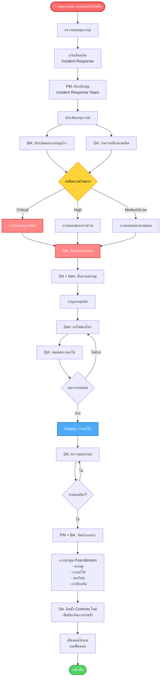

**แนวปฏิบัติ:**
- มีแผนรับมือเหตุการณ์ความปลอดภัยที่ชัดเจน
- กำหนดขั้นตอนการขยายผล
- มีรายชื่อผู้ติดต่อสำหรับการรับมือเหตุการณ์
- ทดสอบแผนอย่างน้อยปีละ 1 ครั้ง

#### 4.5.2 การสื่อสาร

**แนวปฏิบัติ:**
- แจ้งผู้บริหาร AIDC TECH ทันทีเมื่อเกิดเหตุการณ์ความปลอดภัย
- สื่อสารกับผู้มีส่วนได้ส่วนเสียอย่างโปร่งใส
- จัดทำ template การสื่อสารสำหรับแต่ละประเภทเหตุการณ์
- ประสานงานกับทีม PR/Communications เมื่อจำเป็น

#### 4.5.3 การทดสอบแผน

**แนวปฏิบัติ:**
- จำลองสถานการณ์ (tabletop exercises) อย่างน้อยปีละ 1 ครั้ง
- ทบทวนและอัปเดตแผนหลังจากแต่ละเหตุการณ์
- ฝึกอบรมทีมเกี่ยวกับขั้นตอนการรับมือเหตุการณ์

---

### 4.6 Third-Party Library Management: การจัดการไลบรารีของบุคคลที่สาม

#### 4.6.1 การตรวจสอบและเลือกใช้ Third-Party Libraries

**บทบาทและความรับผิดชอบ:**

| ตำแหน่ง | ความรับผิดชอบ |
|---------|---------------|
| **PM** | - อนุมัติการใช้ third-party libraries<br>- ติดตามความเสี่ยงจาก third-party components |
| **SA** | - กำหนดเกณฑ์การเลือก third-party libraries<br>- ทบทวนความเสี่ยงด้าน architecture<br>- จัดทำรายการ libraries ที่ได้รับอนุมัติ |
| **Dev** | - ตรวจสอบความปลอดภัยของไลบรารีก่อนนำมาใช้<br>- สแกนไลบรารีด้วย SCA tools<br>- จัดทำ Software Bill of Materials (SBOM)<br>- ไม่ใช้ libraries ที่หยุดพัฒนาแล้ว |
| **QA** | - ทดสอบความเข้ากันได้และความปลอดภัย<br>- ตรวจสอบการปฏิบัติตาม license<br>- ตรวจสอบช่องโหว่ใน dependencies |

**แนวปฏิบัติ:**
- ใช้เฉพาะ libraries ที่ได้รับการอนุมัติ
- ตรวจสอบความเข้ากันได้ของ license
- ตรวจสอบช่องโหว่ที่ทราบก่อนใช้
- เลือก libraries ที่มีการบำรุงรักษาอย่างต่อเนื่อง

#### 4.6.2 การติดตามช่องโหว่

**แนวปฏิบัติ:**
- subscribe vulnerability databases (NVD, GitHub Security Advisories)
- ใช้ Software Composition Analysis (SCA) tools
- ติดตามประกาศด้านความปลอดภัยจากผู้ให้บริการไลบรารี
- มีขั้นตอนสำหรับการแก้ไขเร่งด่วน

#### 4.6.3 การอัปเดตไลบรารี

**แนวปฏิบัติ:**
- ทบทวนและอัปเดตไลบรารีอย่างสม่ำเสมอ (รายไตรมาส)
- จัดลำดับความสำคัญของ security patches
- ทดสอบอย่างละเอียดก่อนอัปเดตไป production
- จัดการ version control

**บทบาทและความรับผิดชอบ:**

| ตำแหน่ง | ความรับผิดชอบ |
|---------|---------------|
| **Dev** | - ตรวจสอบการอัปเดตและ security patches<br>- ทดสอบการอัปเดตใน development environment<br>- ติดตั้งการอัปเดตหลังการทดสอบ |
| **QA** | - ทำ regression testing หลังการอัปเดตไลบรารี<br>- ตรวจสอบว่าไม่มี breaking changes |

---

### 4.7 Source Code Management & Version Control: การจัดการ Source Code และ Version Control

#### 4.7.1 การจัดการ Source Code

**วัตถุประสงค์:** รักษาความปลอดภัย ความสมบูรณ์ และการตรวจสอบย้อนกลับของ source code

**บทบาทและความรับผิดชอบ:**

| ตำแหน่ง | ความรับผิดชอบ |
|---------|---------------|
| **PM** | - กำหนดนโยบาย source code management<br>- อนุมัติการเข้าถึง repositories<br>- ติดตามการปฏิบัติตามนโยบาย |
| **SA** | - ออกแบบโครงสร้าง repository<br>- กำหนดกลยุทธ์การแตก branch<br>- ทบทวนและอนุมัติการเปลี่ยนแปลง architecture<br>- กำหนดมาตรฐานการจัดระเบียบโค้ด |
| **Dev** | - commit code ตามมาตรฐาน coding<br>- เขียน commit messages ที่มีความหมาย<br>- ไม่ commit ข้อมูลสำคัญ (passwords, keys, tokens)<br>- ใช้ .gitignore อย่างเหมาะสม<br>- ตรวจสอบโค้ดของเพื่อนร่วมทีม |
| **QA** | - ทบทวน commit history<br>- ตรวจสอบว่าไม่มีข้อมูลสำคัญใน repository<br>- ตรวจสอบ code quality metrics |

**แนวปฏิบัติด้านความปลอดภัย:**

1. **ห้ามเด็ดขาด (NEVER):**
   - Commit passwords, API keys, tokens, certificates
   - Commit configuration files ที่มี credentials
   - Commit database connection strings ที่มี passwords
   - Commit private keys หรือ encryption keys
   - Commit ข้อมูล PII (Personally Identifiable Information)

2. **การจัดการ Secrets:**
   - ใช้ environment variables สำหรับข้อมูลสำคัญ
   - ใช้ GitLab CI/CD Variables (masked & protected)
   - ใช้ secret management tools (HashiCorp Vault, AWS Secrets Manager)
   - ใช้ไฟล์ .env (และเพิ่มใน .gitignore)
   - ใช้ Git-secrets หรือ detect-secrets เพื่อป้องกัน accidental commits

3. **มาตรฐาน Commit Message:**
   - ใช้รูปแบบ: `<type>[optional scope]: <description>`
   - Types: `feat`, `fix`, `refactor`, `docs`, `test`, `chore`, `security`, `style`, `perf`, `ci`, `build`
   - ตัวอย่าง: `security: fix SQL injection vulnerability in login system`
   - `[optional body]` สำหรับรายละเอียดเพิ่มเติม
   - `[optional footer(s)]` สำหรับ breaking changes หรืออ้างอิง issue เช่น `Fixes #123`
   - รูปแบบตามมาตรฐาน Conventional Commits (https://www.conventionalcommits.org/)

4. **การจัดระเบียบโค้ด:**
   - แยก source code, tests และ documentation อย่างชัดเจน
   - ใช้ .gitignore สำหรับ build artifacts, dependencies, IDE files
   - รักษาโครงสร้าง repository ให้สะอาด

#### 4.7.2 Git Flow และ Branching Strategy

**วัตถุประสงค์:** ใช้ Git Flow เพื่อจัดการการพัฒนาอย่างเป็นระบบและปลอดภัย

**กลยุทธ์การแตก Branch ของ AIDC Tech:**

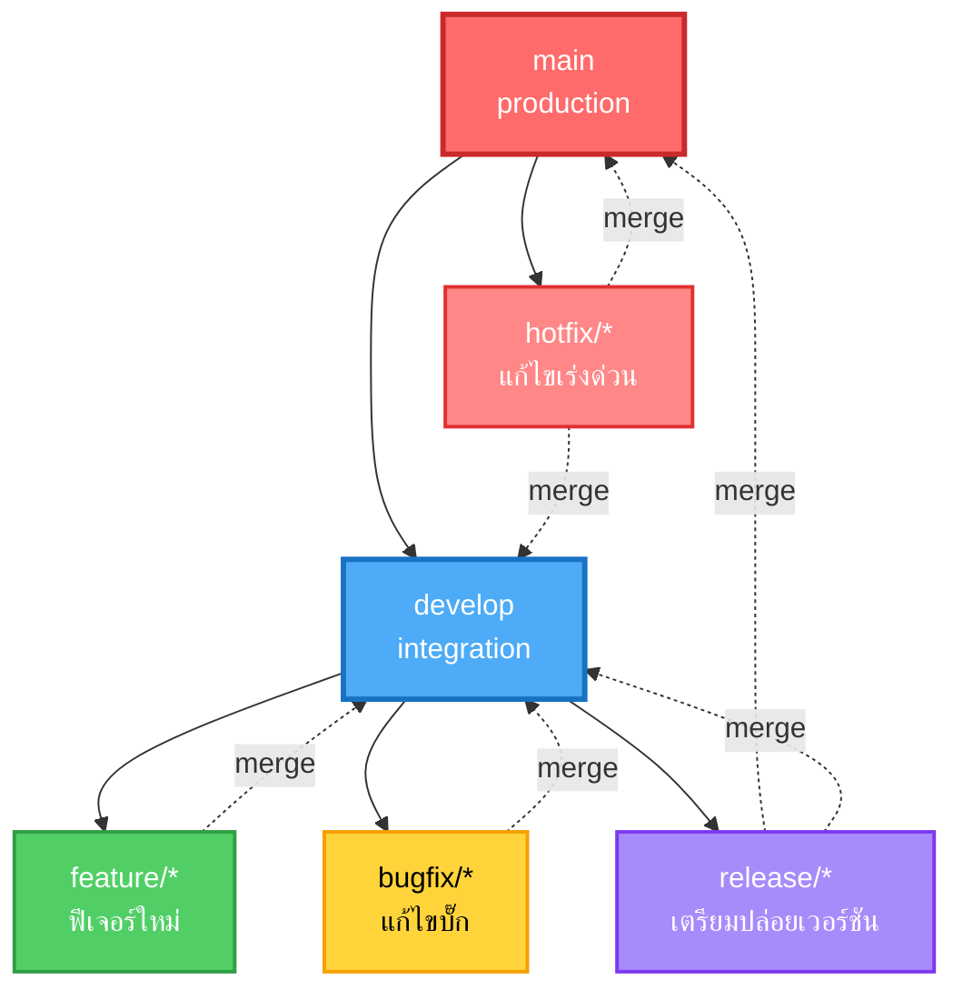

**ประเภท Branch และกฎการใช้งาน:**

| ประเภท Branch | วัตถุประสงค์ | ป้องกัน | ใครสามารถ Merge | รูปแบบการตั้งชื่อ |
|--------------|-------------|---------|------------------|------------------|
| **main** | โค้ด Production | ✓ | PM, SA | main |
| **develop** | Integration branch | ✓ | SA, Dev Lead | develop |
| **feature/** | ฟีเจอร์ใหม่ | ✗ | Dev | feature/TICKET-123-description |
| **bugfix/** | แก้ไขบั๊ก | ✗ | Dev | bugfix/TICKET-123-description |
| **hotfix/** | แก้ไขเร่งด่วน | ✗ | SA, Dev Lead | hotfix/TICKET-123-description |
| **release/** | เตรียมปล่อยเวอร์ชัน | ✗ | SA, PM | release/v1.2.3 |

**ขั้นตอน Git Flow:**

**1. การพัฒนาฟีเจอร์:**

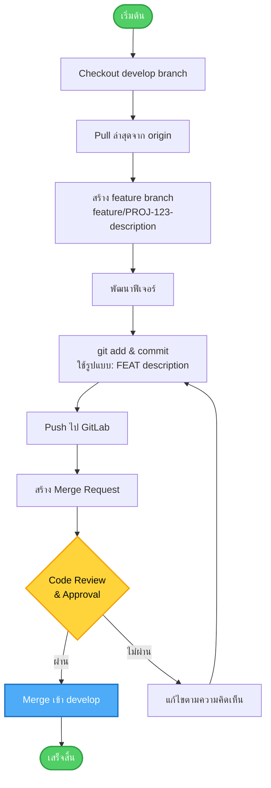

**2. การแก้ไขบั๊ก:**

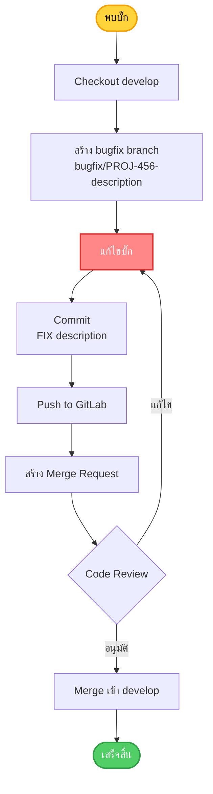

**3. Hotfix (แก้ไขเร่งด่วน):**

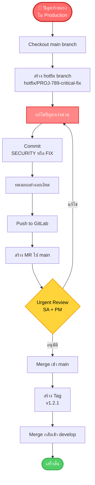

**4. ขั้นตอนการปล่อยเวอร์ชัน:**

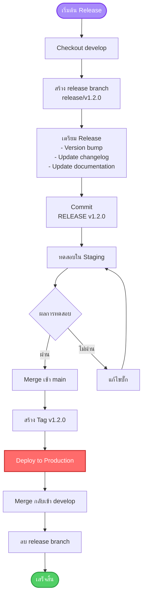

**บทบาทและความรับผิดชอบใน Git Flow:**

| ตำแหน่ง | ความรับผิดชอบ |
|---------|---------------|
| **PM** | - อนุมัติตารางการปล่อยเวอร์ชัน<br>- ทบทวน release notes<br>- ประสานงานกิจกรรมการปล่อยเวอร์ชัน |
| **SA** | - ทบทวนและอนุมัติ merge requests เข้า main<br>- ทบทวนการเปลี่ยนแปลง architectural<br>- จัดการ release branches |
| **Dev** | - สร้างและพัฒนาใน feature/bugfix branches<br>- ปฏิบัติตามรูปแบบการตั้งชื่อ branch<br>- ทำ code review สำหรับเพื่อนร่วมงาน<br>- แก้ไข merge conflicts |
| **QA** | - ทดสอบใน develop branch<br>- ตรวจสอบการแก้ไขใน bugfix branches<br>- อนุมัติการปล่อยเวอร์ชัน |

**แนวปฏิบัติ:**
- ใช้ชื่อ branch ที่มีความหมายและอ้างอิง ticket
- ลบ branches หลัง merge แล้ว
- rebase feature branches จาก develop เป็นประจำ
- ห้าม force push ไปยัง protected branches
- ใช้ merge commits (ไม่ใช้ squash) เพื่อรักษา history

#### 4.7.3 การทำงานบน GitLab

**วัตถุประสงค์:** ใช้ GitLab เป็นแพลตฟอร์มกลางสำหรับ source code management, CI/CD และการทำงานร่วมกัน

**โครงสร้าง GitLab Project:**

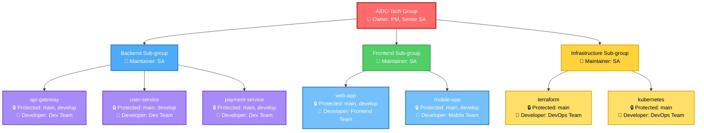

**ฟีเจอร์ GitLab และการใช้งาน:**

**1. Merge Requests (MR):**

**ข้อกำหนดของ MR (บังคับใช้โดย GitLab):**
- ต้องมีผู้อนุมัติอย่างน้อย 1-2 คน (ขึ้นกับ target branch)
- Pipeline ต้อง pass
- ไม่มีการสนทนาที่ยังไม่แก้ไข
- อัปเดตล่าสุดกับ target branch
- SonarQube quality gate ต้อง pass

**Template สำหรับ MR:**
```markdown
## คำอธิบาย
[คำอธิบายสั้นๆ เกี่ยวกับการเปลี่ยนแปลง]

## ประเภทการเปลี่ยนแปลง
- [ ] แก้ไขบั๊ก
- [ ] ฟีเจอร์ใหม่
- [ ] การเปลี่ยนแปลงที่ทำลายความเข้ากันได้
- [ ] แก้ไขความปลอดภัย
- [ ] อัปเดตเอกสาร

## Issue ที่เกี่ยวข้อง
ปิด #[หมายเลข issue]

## ข้อควรพิจารณาด้านความปลอดภัย
[ผลกระทบด้านความปลอดภัยใดๆ]

## การทดสอบ
- [ ] เพิ่ม/อัปเดต unit tests
- [ ] เพิ่ม/อัปเดต integration tests
- [ ] ทดสอบด้วยตนเองเสร็จสิ้น

## ภาพหน้าจอ (ถ้ามี)
[เพิ่มภาพหน้าจอ]

## รายการตรวจสอบ
- [ ] โค้ดปฏิบัติตามแนวทางการเขียนโค้ด
- [ ] ตรวจสอบตนเองเสร็จสิ้น
- [ ] เพิ่มคำอธิบายสำหรับโค้ดที่ซับซ้อน
- [ ] อัปเดตเอกสาร
- [ ] ไม่มีข้อมูลสำคัญในโค้ด
- [ ] SonarQube quality gate ผ่าน
```

**ขั้นตอนการตรวจสอบ MR:**

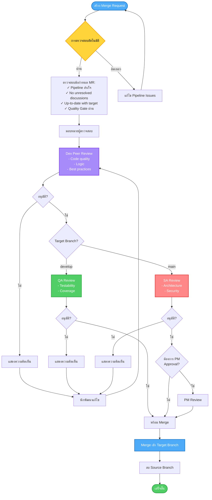

**2. GitLab CI/CD Pipeline:**

**ขั้นตอน Pipeline:**

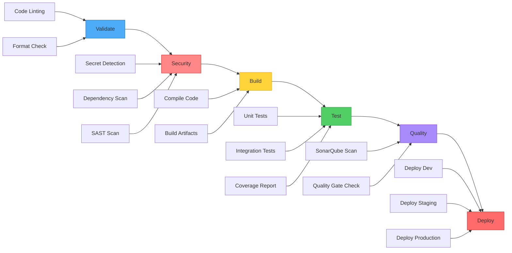

**ขั้นตอนการดำเนินการ Pipeline แบบละเอียด:**

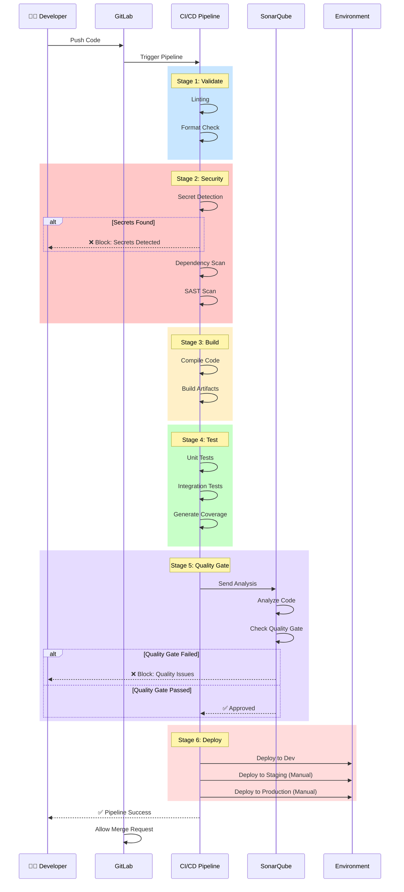

**งาน Pipeline ที่จำเป็น:**

```yaml
# สแกนความปลอดภัย
secret-detection:
  stage: security
  script:
    - detect-secrets scan --all-files

dependency-scan:
  stage: security
  script:
    - npm audit / pip-audit

# SAST
sast:
  stage: security
  image: sonarqube
  script:
    - sonar-scanner

# Quality Gate
quality-gate:
  stage: quality
  script:
    - sonarqube-quality-gate-check
  allow_failure: false  # บล็อก MR ถ้าล้มเหลว

# Unit Tests
unit-tests:
  stage: test
  script:
    - npm test / pytest
  coverage: '/Coverage: \d+\.\d+%/'
  artifacts:
    reports:
      coverage_report:
        coverage_format: cobertura
        path: coverage/cobertura-coverage.xml
```

**3. GitLab Protected Branches:**

| Branch | Push | Merge | Force Push |
|--------|------|-------|------------|
| **main** | Maintainer เท่านั้น | Maintainer + SA | ✗ |
| **develop** | Developer + | Developer + | ✗ |
| **feature/** | นักพัฒนาทุกคน | นักพัฒนาทุกคน | ✓ (branch ของตัวเอง) |

**4. GitLab Protected Tags:**

**รูปแบบ Tag:** `v*.*.*` (เช่น v1.2.3)
- สามารถสร้าง: Maintainer เท่านั้น
- สามารถลบ: ไม่มีใคร
- ใช้สำหรับการปล่อยเวอร์ชันเท่านั้น

**5. การตั้งค่า GitLab Repository:**

**การตั้งค่าทั่วไป:**
- ✓ ปิดการใช้งาน forking (สำหรับโปรเจกต์ที่มีข้อมูลสำคัญ)
- ✓ อนุญาต merge requests เมื่อ pipeline สำเร็จเท่านั้น
- ✓ อนุญาต merge requests เมื่อการสนทนาทั้งหมดได้รับการแก้ไข
- ✓ ต้องได้รับการอนุมัติจาก code owners
- ✓ ลบ source branch หลัง merge

**การตั้งค่าความปลอดภัย:**
- ✓ เปิดใช้งาน secret detection
- ✓ เปิดใช้งาน dependency scanning
- ✓ เปิดใช้งาน SAST
- ✓ เปิดใช้งาน container scanning
- การแจ้งเตือนทางอีเมลสำหรับการแจ้งเตือนความปลอดภัย

**6. GitLab Issues และ Boards:**

**Issue Templates:**
- Bug Report
- Feature Request
- Security Vulnerability
- Technical Debt

**ระบบ Labels:**
- ความสำคัญ: `P1-Critical`, `P2-High`, `P3-Medium`, `P4-Low`
- ประเภท: `bug`, `feature`, `security`, `technical-debt`
- สถานะ: `to-do`, `in-progress`, `review`, `done`
- ความปลอดภัย: `security::critical`, `security::high`

**บทบาทและความรับผิดชอบ:**

| ตำแหน่ง | ความรับผิดชอบ |
|---------|---------------|
| **PM** | - จัดการ GitLab Groups และ Projects<br>- กำหนดการตั้งค่าโปรเจกต์<br>- ติดตาม metrics ของ merge request<br>- จัดการ milestones และ releases |
| **SA** | - ทบทวนและอนุมัติ merge requests<br>- กำหนด CI/CD pipeline<br>- จัดการกฎการป้องกัน branch<br>- ตั้งค่า quality gates |
| **Dev** | - สร้าง merge requests<br>- ตอบสนองความคิดเห็นจากการตรวจสอบ<br>- แก้ไข merge conflicts<br>- ดูแล pipeline configurations |
| **QA** | - ทบทวน merge requests จากมุมมองการทดสอบ<br>- ตรวจสอบผลการทดสอบใน pipeline<br>- อัปเดต test automation ใน pipelines |

#### 4.7.4 สิทธิ์การเข้าถึง GitLab Repository

**วัตถุประสงค์:** ควบคุมการเข้าถึง source code ตามหลักการ Least Privilege

**ระดับการเข้าถึง GitLab:**

| บทบาท | สิทธิ์ | กรณีการใช้งาน |
|------|-------|---------------|
| **Guest** | - ดู issues และ merge requests<br>- แสดงความคิดเห็นใน issues | BA, PM (การเข้าถึงแบบอ่านอย่างเดียว) |
| **Reporter** | + ดาวน์โหลดโปรเจกต์<br>+ Pull repository<br>+ ดู pipelines | QA, BA |
| **Developer** | + Push ไปยัง non-protected branches<br>+ สร้าง merge requests<br>+ ลบ non-protected branches | Dev, QA |
| **Maintainer** | + Push ไปยัง protected branches<br>+ จัดการสมาชิกทีม<br>+ จัดการการตั้งค่า repository | SA, Dev Lead |
| **Owner** | + การเข้าถึงแบบเต็ม<br>+ ลบโปรเจกต์<br>+ โอนโปรเจกต์ | PM, Senior SA |

**Access Matrix สำหรับ AIDC Tech:**

| ตำแหน่ง | บทบาท GitLab | เข้าถึง main | เข้าถึง develop | สามารถอนุมัติ MR |
|---------|--------------|--------------|-----------------|------------------|
| **PM** | Owner | อ่าน | อ่าน | ✓ (ไปยัง main) |
| **BA** | Reporter | อ่าน | อ่าน | ✗ |
| **UI/UX** | Reporter | อ่าน | อ่าน | ✗ |
| **SA** | Maintainer | อ่าน/เขียน | อ่าน/เขียน | ✓ (ทั้งหมด) |
| **Dev Lead** | Maintainer | อ่าน/เขียน | อ่าน/เขียน | ✓ (ไปยัง develop) |
| **Dev** | Developer | อ่าน | อ่าน/เขียน | ✓ (peer review) |
| **QA** | Developer | อ่าน | อ่าน/เขียน | ✓ (testing sign-off) |

**การขอและการจัดการสิทธิ์:**

**1. การขอสิทธิ์ใหม่:**

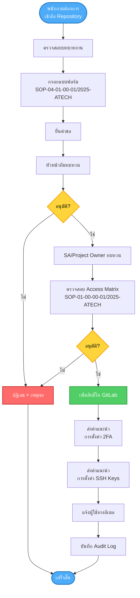

**2. การทบทวนสิทธิ์:**

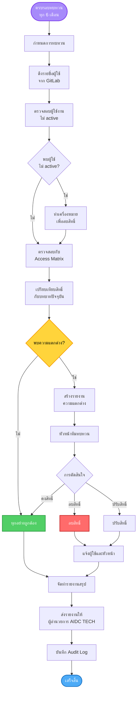

**3. การยกเลิกสิทธิ์:**

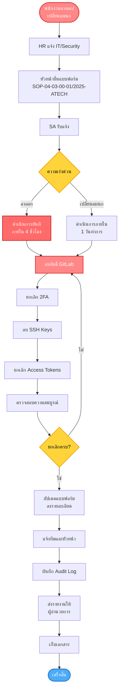

**แนวปฏิบัติด้านความปลอดภัยสำหรับการเข้าถึง GitLab:**

1. **Multi-Factor Authentication (2FA):**
   - บังคับใช้ 2FA สำหรับทุกคน
   - ใช้ authenticator app (Google Authenticator, Authy)
   - Backup codes เก็บไว้ในที่ปลอดภัย

2. **การจัดการ SSH Keys:**
   - ใช้ SSH keys แทน passwords
   - RSA 4096-bit หรือ ED25519
   - เปลี่ยน keys ทุก 12 เดือน
   - เพิ่ม passphrase ให้ SSH keys
   - ลบ keys ที่ไม่ได้ใช้

3. **Personal Access Tokens (PAT):**
   - ใช้ PAT สำหรับ automation เท่านั้น
   - กำหนดวันหมดอายุ (สูงสุด 90 วัน)
   - ใช้ scopes ขั้นต่ำที่จำเป็น
   - เปลี่ยน tokens เป็นระยะ
   - เก็บ tokens ใน secret manager

4. **การบันทึก Audit:**
   - เปิดใช้งาน audit log ทุกโปรเจกต์
   - ทบทวน logs รายเดือน
   - แจ้งเตือนสำหรับกิจกรรมที่น่าสงสัย
   - เก็บ logs อย่างน้อย 1 ปี

**แนวปฏิบัติการใช้ GitLab อย่างปลอดภัย:**

```markdown
✓ ควรทำ:
- ใช้ 2FA เสมอ
- ใช้ SSH keys แทน passwords
- Clone repositories ผ่าน SSH
- ทบทวนสิทธิ์เป็นระยะ
- รายงานกิจกรรมที่น่าสงสัยทันที
- เซ็น commits ด้วย GPG (แนะนำ)

✗ ไม่ควรทำ:
- แชร์ passwords หรือ tokens
- ใช้ shared accounts
- Clone repositories ผ่าน HTTPS บน public networks
- เก็บ credentials ใน browser
- ให้สิทธิ์เกินจำเป็น
```

#### 4.7.5 Quality Gate ใน SonarQube

**วัตถุประสงค์:** ใช้ SonarQube Quality Gate เพื่อรักษามาตรฐานคุณภาพและความปลอดภัยของโค้ด

**การรวม SonarQube:**

**1. การตั้งค่าและ Configuration:**

```yaml
# .gitlab-ci.yml
sonarqube-scan:
  stage: security
  image: sonarsource/sonar-scanner-cli:latest
  variables:
    SONAR_PROJECT_KEY: "${CI_PROJECT_NAME}"
    SONAR_HOST_URL: "https://sonarqube.aidc-tech.com"
    SONAR_TOKEN: "${SONAR_TOKEN}"  # เก็บใน GitLab CI/CD Variables
  script:
    - sonar-scanner
      -Dsonar.projectKey=${SONAR_PROJECT_KEY}
      -Dsonar.sources=src
      -Dsonar.tests=tests
      -Dsonar.host.url=${SONAR_HOST_URL}
      -Dsonar.login=${SONAR_TOKEN}
      -Dsonar.coverage.exclusions=**/*test*/**,**/*mock*/**
      -Dsonar.qualitygate.wait=true
  allow_failure: false  # บล็อก MR ถ้า quality gate ล้มเหลว
  only:
    - merge_requests
    - develop
    - main
```

**2. การตั้งค่า AIDC Tech Quality Gate:**

**ชื่อ Quality Gate:** `AIDC-Tech-Secure-Development`

| ตัวชี้วัด | เงื่อนไข | ค่า | ล้มเหลวเมื่อ |
|----------|---------|-----|-------------|
| **ความปลอดภัย** | | | |
| Security Hotspots Reviewed | น้อยกว่า | 100% | ✓ ล้มเหลว |
| Security Rating | แย่กว่า | A | ✓ ล้มเหลว |
| Vulnerabilities | มากกว่า | 0 (Critical/High) | ✓ ล้มเหลว |
| **ความน่าเชื่อถือ** | | | |
| Reliability Rating | แย่กว่า | A | ✓ ล้มเหลว |
| Bugs | มากกว่า | 0 (Critical/High) | ✓ ล้มเหลว |
| **ความสามารถในการบำรุงรักษา** | | | |
| Maintainability Rating | แย่กว่า | A | ⚠ คำเตือน |
| Code Smells | มากกว่า | 10 (Critical/High) | ⚠ คำเตือน |
| Technical Debt Ratio | มากกว่า | 5% | ⚠ คำเตือน |
| **ความครอบคลุม** | | | |
| Coverage on New Code | น้อยกว่า | 80% | ✓ ล้มเหลว |
| Line Coverage | น้อยกว่า | 70% | ⚠ คำเตือน |
| **การซ้ำซ้อน** | | | |
| Duplicated Lines (%) on New Code | มากกว่า | 3% | ⚠ คำเตือน |
| **ขนาด** | | | |
| Lines of Code | - | เพื่อข้อมูล | - |

**ระดับความร้ายแรง:**

| ความร้ายแรง | คำอธิบาย | การดำเนินการที่ต้องทำ |
|------------|----------|----------------------|
| **Blocker** | ข้อบกพร่องร้ายแรงที่อาจทำให้ application crash | แก้ไขก่อน merge (บังคับ) |
| **Critical** | ช่องโหว่ด้านความปลอดภัยหรือการสูญเสียข้อมูล | แก้ไขก่อน merge (บังคับ) |
| **Major** | ปัญหาสำคัญที่ส่งผลต่อการทำงาน | แก้ไขก่อน merge (แนะนำ) |
| **Minor** | ปัญหาเล็กน้อยที่ควรแก้ไข | แก้ไขตาม sprint planning |
| **Info** | ข้อมูลเพื่อการปรับปรุง | ไม่บังคับ |

**3. ขั้นตอน Quality Gate:**

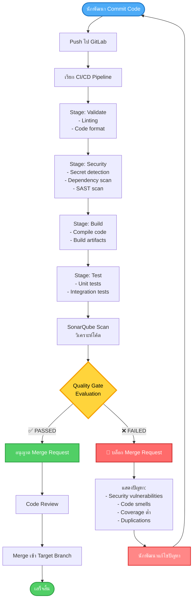

**4. กฎความปลอดภัย SonarQube:**

**Security Hotspots (ต้องทบทวน 100%):**
- ความเสี่ยง SQL Injection
- ความเสี่ยง Cross-Site Scripting (XSS)
- ความเสี่ยง Path Traversal
- ความเสี่ยง Command Injection
- ความเสี่ยง LDAP Injection
- ความเสี่ยง XML External Entity (XXE)
- การใช้งาน Cryptography ที่ไม่ปลอดภัย
- กลไก Authentication ที่อ่อนแอ
- ความเสี่ยงการข้าม Authorization
- การเปิดเผยข้อมูลสำคัญ

**Vulnerabilities (ต้องแก้ไขก่อน merge):**

| หมวดหมู่ | ตัวอย่าง | ความสำคัญ |
|---------|---------|----------|
| **Injection** | SQL, LDAP, OS Command | Critical |
| **Broken Authentication** | รหัสผ่านอ่อนแอ, credentials ที่เปิดเผย | Critical |
| **Sensitive Data Exposure** | ข้อมูลไม่เข้ารหัส, secrets ที่ฝังในโค้ด | Critical |
| **XXE** | การแยกวิเคราะห์ XML ที่ไม่ปลอดภัย | High |
| **Broken Access Control** | ขาดการตรวจสอบ authorization | High |
| **Security Misconfiguration** | การตั้งค่าเริ่มต้น, ฟีเจอร์ที่ไม่จำเป็น | High |
| **XSS** | user input ที่ไม่ได้เข้ารหัส | High |
| **Insecure Deserialization** | object deserialization ที่ไม่ปลอดภัย | High |
| **Using Components with Known Vulnerabilities** | ไลบรารีที่ล้าสมัย | Medium-Critical |
| **Insufficient Logging** | ขาดการบันทึก security event | Medium |

**5. บทบาทและความรับผิดชอบใน SonarQube:**

| ตำแหน่ง | ความรับผิดชอบ |
|---------|---------------|
| **PM** | - ติดตามแนวโน้มคุณภาพ<br>- ทบทวนรายงาน quality gate<br>- จัดสรรเวลาสำหรับการลด technical debt |
| **SA** | - กำหนด quality gate thresholds<br>- ปรับแต่งกฎ SonarQube<br>- ทบทวนและจัดลำดับความสำคัญของผลการตรวจสอบ<br>- อนุมัติ quality gate waivers (กรณีพิเศษเท่านั้น) |
| **Dev** | - แก้ไขปัญหาที่ SonarQube พบ<br>- ทบทวนและจัดการ security hotspots<br>- รักษา code coverage >80%<br>- ปรับโครงสร้างโค้ดเพื่อลด technical debt<br>- เขียนคำอธิบายเพื่ออธิบาย false positives |
| **QA** | - ตรวจสอบ test coverage metrics<br>- ยืนยันการแก้ไขปัญหาความปลอดภัย<br>- ติดตามแนวโน้มคุณภาพ<br>- รายงานรูปแบบที่เกิดซ้ำ |

**6. การจัดการผลการตรวจสอบ SonarQube:**

**ขั้นตอนสำหรับ Security Hotspots:**

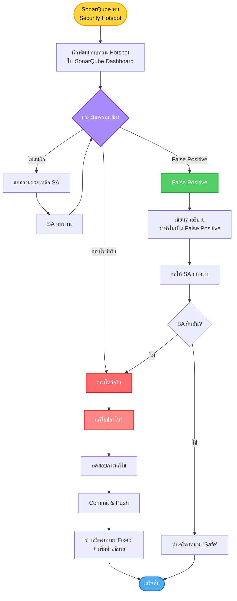

**ขั้นตอนสำหรับ Vulnerabilities:**

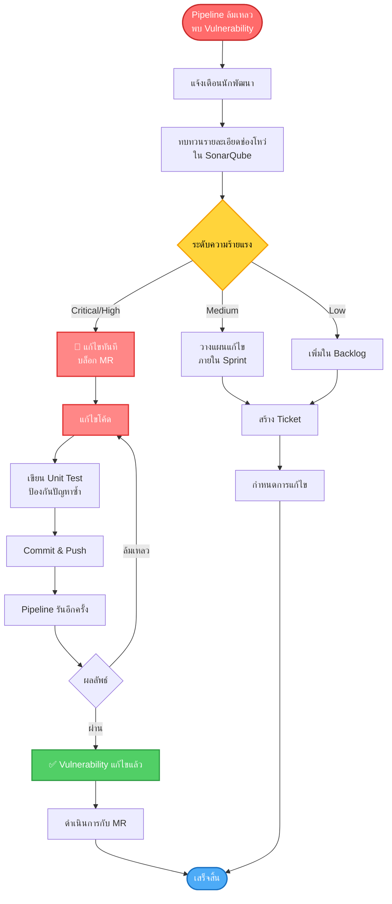

**7. รายงานและ Dashboards ของ SonarQube:**

**รายงานประจำ:**
- **รายวัน:** การแจ้งเตือน quality gate ที่ล้มเหลว
- **รายสัปดาห์:** แนวโน้มและ metrics ของคุณภาพ
- **รายเดือน:** รายงาน Technical debt
- **รายไตรมาส:** สรุปช่องโหว่ด้านความปลอดภัย

**Dashboards หลัก:**
- คุณภาพโค้ดโดยรวม
- การติดตามช่องโหว่ด้านความปลอดภัย
- แนวโน้มความครอบคลุมของโค้ด
- วิวัฒนาการของ Technical Debt
- คุณภาพโค้ดใหม่

**8. ข้อยกเว้นและ Waivers:**

**เมื่อใดที่สามารถขอ Quality Gate Waiver:**
- Hotfix ฉุกเฉิน (ปัญหา production ร้ายแรง)
- False positives ที่ยืนยันแล้วโดย SA
- ปัญหาที่อยู่ในแผนแก้ไข (ต้องมี ticket)

**ขั้นตอน:**
```
1. นักพัฒนาจัดทำเอกสารเหตุผลใน MR description
2. SA ทบทวนและประเมินความเสี่ยง
3. PM อนุมัติ (สำหรับกรณีที่สำคัญเท่านั้น)
4. สร้าง technical debt ticket
5. กำหนดการแก้ไขภายใน sprint ถัดไป
```

**Template สำหรับ Waiver:**
```markdown
## คำขอ Quality Gate Waiver

**โปรเจกต์:** [ชื่อโปรเจกต์]
**MR:** !123
**ขอโดย:** [ชื่อนักพัฒนา]
**วันที่:** [วันที่]

### เหตุผลในการขอ Waiver:
[อธิบายว่าทำไมต้องการ waiver]

### การประเมินความเสี่ยง:
[อธิบายความเสี่ยงที่อาจเกิดขึ้น]

### แผนการแก้ไข:
- [ ] สร้าง technical debt ticket แล้ว: PROJ-XXX
- [ ] กำหนดการแก้ไข: Sprint XX
- [ ] ผู้รับผิดชอบ: [ชื่อ]

### การอนุมัติ:
- [ ] SA: [ชื่อ] - [วันที่]
- [ ] PM: [ชื่อ] - [วันที่]
```

**9. Best Practices:**

**แนวปฏิบัติสำหรับนักพัฒนา:**
- รัน local SonarLint ก่อน commit
- แก้ไขปัญหาก่อนสร้าง MR
- ไม่ ignore คำเตือนโดยไม่มีเหตุผล
- เขียน unit tests เพื่อเพิ่ม coverage
- ทบทวน feedback จาก SonarQube ทุก commit

**แนวปฏิบัติสำหรับทีม:**
- Sprint planning รวม technical debt items
- ทบทวน SonarQube metrics ใน sprint retrospective
- ฉลองเมื่อ quality metrics ดีขึ้น
- แชร์ความรู้เกี่ยวกับปัญหาทั่วไป

**10. การแจ้งเตือนและการแจ้งเตือนของ SonarQube:**

**ช่องทางการแจ้งเตือน:**
- การแจ้งเตือนทางอีเมลสำหรับ quality gate failures
- ความคิดเห็นใน GitLab MR สำหรับปัญหาที่พบ
- การแจ้งเตือน Slack/Teams สำหรับช่องโหว่ร้ายแรง

**ผู้รับการแจ้งเตือน:**
- นักพัฒนา: ปัญหาทั้งหมดในโค้ดของตนเอง
- SA: ช่องโหว่ด้านความปลอดภัยระดับ Critical และ High
- PM: Quality gate failures ที่บล็อกการปล่อยเวอร์ชัน

---

## 5. การฝึกอบรมและการรับรู้

### 5.1 การฝึกอบรม

**บทบาทและความรับผิดชอบ:**

| ตำแหน่ง | การฝึกอบรมที่ต้องเข้า |
|---------|------------------------|
| **PM** | - การฝึกอบรมด้านความตระหนักด้านความปลอดภัย<br>- การฝึกอบรมการตอบสนองเหตุการณ์<br>- การจัดการความเสี่ยง |
| **BA** | - การวิเคราะห์ข้อกำหนดด้านความปลอดภัย<br>- ความเป็นส่วนตัวและการปกป้องข้อมูล<br>- พื้นฐาน Threat modeling |
| **UI/UX** | - การออกแบบ UX ที่ปลอดภัย<br>- Privacy by design<br>- การรับรู้ social engineering |
| **SA** | - การออกแบบ architecture ที่ปลอดภัย<br>- Threat modeling<br>- Security frameworks (ISO 27001, NIST) |
| **Dev** | - การฝึกอบรม Secure coding (OWASP Top 10)<br>- เครื่องมือทดสอบความปลอดภัย<br>- พื้นฐานการเข้ารหัส |
| **QA** | - วิธีการทดสอบความปลอดภัย<br>- การประเมินช่องโหว่<br>- เครื่องมือทดสอบความปลอดภัย (SAST/DAST) |

**แนวปฏิบัติ:**
- พนักงานใหม่ต้องเข้ารับการอบรมด้านความตระหนักด้านความปลอดภัยภายใน 30 วัน
- การฝึกอบรมซ้ำอย่างน้อยปีละ 1 ครั้ง
- การฝึกอบรม hands-on สำหรับตำแหน่งทางเทคนิค
- ติดตามและจัดทำเอกสารการฝึกอบรม

---

## 6. การวัดผลและการปรับปรุง

### 6.1 ตัวชี้วัดความปลอดภัย

**ตัวชี้วัด (KPIs):**
- จำนวนช่องโหว่ด้านความปลอดภัยที่พบและแก้ไข
- เวลาเฉลี่ยในการแก้ไขช่องโหว่ (MTTR)
- ผลการ penetration testing
- Code coverage ของ security tests
- จำนวนเหตุการณ์ด้านความปลอดภัย
- เปอร์เซ็นต์ของโค้ดที่ผ่าน SAST/DAST
- จำนวน libraries/dependencies ที่ล้าสมัย

### 6.2 การรายงาน

**บทบาทและความรับผิดชอบ:**

| ตำแหน่ง | ความรับผิดชอบ |
|---------|---------------|
| **PM** | - รายงานสถานะความปลอดภัยต่อผู้บริหาร<br>- จัดทำ dashboard ความปลอดภัยรายเดือน |
| **SA** | - วิเคราะห์ security metrics<br>- จัดทำรายงานความปลอดภัยทางเทคนิค |
| **QA** | - รายงานผลการทดสอบความปลอดภัย<br>- ติดตามการแก้ไขช่องโหว่ |

**แนวปฏิบัติ:**
- รายงาน security metrics ต่อผู้อำนวยการ AIDC TECH รายเดือน
- ประชุมทบทวนความปลอดภัยรายไตรมาส
- รายงานการตรวจสอบความปลอดภัยประจำปี

### 6.3 การปรับปรุงอย่างต่อเนื่อง

**แนวปฏิบัติ:**
- ทบทวนและอัปเดตนโยบายนี้อย่างน้อยปีละ 1 ครั้ง
- รวมบทเรียนที่ได้รับจากเหตุการณ์
- นำ best practices ด้านความปลอดภัยใหม่ๆ มาใช้
- เปรียบเทียบกับมาตรฐานอุตสาหกรรม

---

## 7. การบังคับใช้และบทลงโทษ

7.1 การไม่ปฏิบัติตามนโยบายนี้ถือเป็นการกระทำผิดทางวินัย

7.2 AIDC TECH จะดำเนินการตรวจสอบการปฏิบัติตามนโยบายของพนักงานอย่างสม่ำเสมอ

7.3 การฝ่าฝืนนโยบายอาจส่งผลให้ถูกดำเนินการทางวินัย รวมถึงการเลิกจ้าง

---

## 8. เอกสารอ้างอิง

8.1 02 Information Security Policy.docx

8.2 04 Information Classification and Handling Policy.docx

8.3 SOP-2-2025 Access Request Procedure.docx

8.4 SOP-4-2025 Access Termination Procedure.docx

8.5 SOP-5-2025 Access Privilege Review Procedure.docx

8.6 SOP-01-00-00-01/2025-ATECH User Access Matrix

8.7 OWASP Top 10: https://owasp.org/www-project-top-ten/

8.8 OWASP Secure Coding Practices: https://owasp.org/www-project-secure-coding-practices-checklist/

8.9 OWASP Threat Modeling: https://owasp.org/www-project-threat-model/

---

## 9. การอนุมัติและการทบทวน

| รายละเอียด | ข้อมูล |
|-----------|--------|
| **จัดทำโดย:** | ทีมพัฒนาซอฟต์แวร์ AIDC TECH |
| **ทบทวนโดย:** | หัวหน้าทีม IT Security |
| **อนุมัติโดย:** | ผู้อำนวยการ AIDC TECH |
| **วันที่อนุมัติ:** | [วัน/เดือน/ปี] |
| **วันที่มีผลบังคับใช้:** | [วัน/เดือน/ปี] |
| **กำหนดทบทวนครั้งถัดไป:** | [วัน/เดือน/ปี] (1 ปีหลังจากมีผลบังคับใช้) |

---

## ภาคผนวก A: รายการตรวจสอบความปลอดภัยตามขั้นตอนการพัฒนา

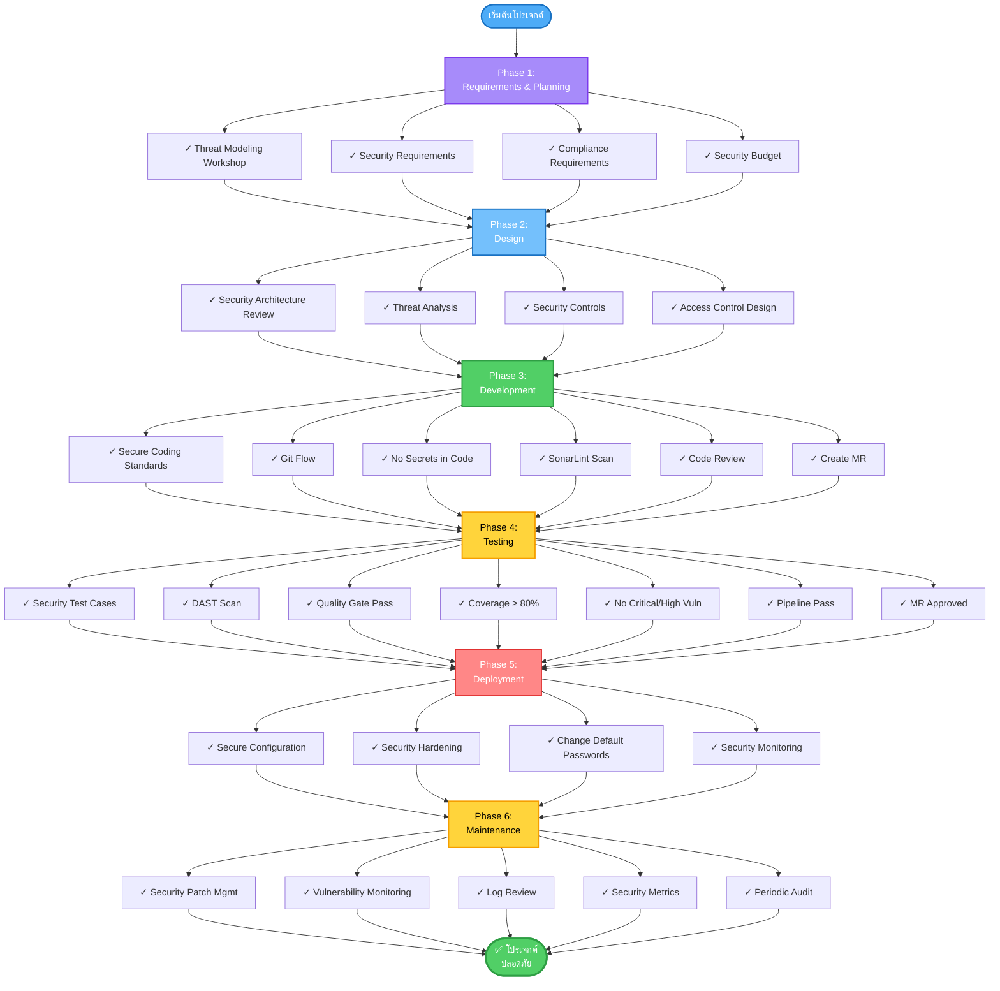

**รายละเอียดรายการตรวจสอบ:**

### Phase 1: Requirements & Planning
- [ ] จัดทำ Threat Modeling Workshop (SA, BA, PM)
- [ ] กำหนด security requirements (BA, SA)
- [ ] กำหนด compliance requirements (BA)
- [ ] จัดทำงบประมาณด้านความปลอดภัย (PM)

### Phase 2: Design
- [ ] ทบทวน Security architecture (SA)
- [ ] Data flow diagram และการวิเคราะห์ภัยคุกคาม (SA)
- [ ] กำหนด security controls (SA)
- [ ] ทบทวนการออกแบบ Secure UX (UI/UX)
- [ ] การออกแบบ Access control (SA, BA)

### Phase 3: Development
- [ ] ปฏิบัติตาม secure coding standards (Dev)
- [ ] ปฏิบัติตาม Git Flow และ branching strategy (Dev)
- [ ] ไม่ commit ข้อมูลสำคัญ (passwords, keys, tokens) (Dev)
- [ ] เขียน commit messages ที่มีความหมาย (Dev)
- [ ] สร้าง feature branch จาก develop (Dev)
- [ ] รัน SonarLint locally ก่อน commit (Dev)
- [ ] เรียกใช้ SAST tools (Dev)
- [ ] การสแกน SonarQube ผ่าน (Dev)
- [ ] Code review ด้านความปลอดภัย (Dev, SA)
- [ ] ใช้ libraries ที่ได้รับอนุมัติเท่านั้น (Dev)
- [ ] ติดตั้ง encryption (Dev)
- [ ] Push โค้ดและสร้าง Merge Request ใน GitLab (Dev)
- [ ] กรอก MR template ครบถ้วน (Dev)

### Phase 4: Testing
- [ ] Security test cases (QA)
- [ ] เรียกใช้ DAST tools (QA)
- [ ] Vulnerability scanning (QA)
- [ ] Penetration testing (External/QA)
- [ ] Security regression testing (QA)
- [ ] SonarQube Quality Gate ผ่าน (QA)
- [ ] Code coverage ≥ 80% สำหรับโค้ดใหม่ (QA, Dev)
- [ ] Security Hotspots ทบทวน 100% (Dev, SA)
- [ ] ช่องโหว่ระดับ Critical/High เป็นศูนย์ (Dev, QA)
- [ ] GitLab Pipeline ผ่าน (ทุกคน)
- [ ] MR ได้รับอนุมัติจากผู้ตรวจสอบที่จำเป็น (SA, Dev Lead)

### Phase 5: Deployment
- [ ] ทบทวน Secure configuration (SA, Dev)
- [ ] Security hardening (Dev)
- [ ] เปลี่ยน default passwords (Dev)
- [ ] ตั้งค่า Security monitoring (Dev, SA)
- [ ] เปิดใช้งานแผนรับมือเหตุการณ์ (PM)

### Phase 6: Maintenance
- [ ] การจัดการ Security patch (Dev)
- [ ] การตรวจสอบช่องโหว่ (Dev, QA)
- [ ] การทบทวน Log (SA)
- [ ] การรายงาน Security metrics (PM, QA)
- [ ] การตรวจสอบความปลอดภัยเป็นระยะ (ทุกคน)

---

## ภาคผนวก B: ตัวอย่างเครื่องมือความปลอดภัย

**ระบบนิเวศเครื่องมือความปลอดภัย:**

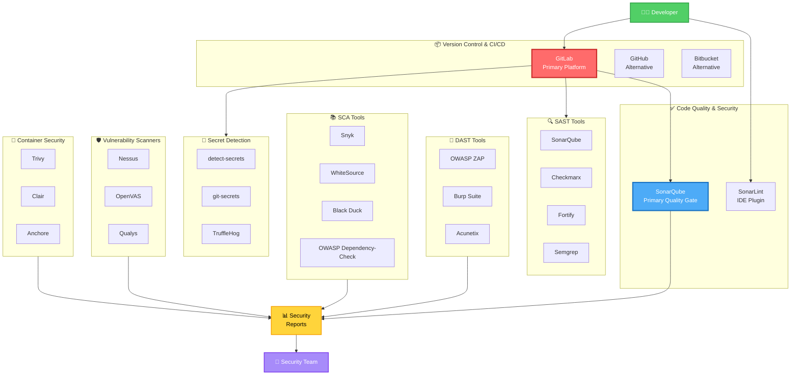

**เครื่องมือตามขั้นตอนการพัฒนา:**

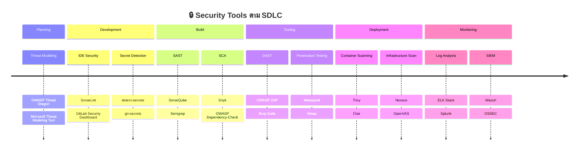

---

## ภาคผนวก C: Template ของ GitLab CI/CD Pipeline

### ตัวอย่าง Pipeline แบบสมบูรณ์

```yaml
# .gitlab-ci.yml สำหรับโปรเจกต์ AIDC Tech

variables:
  SONAR_HOST_URL: "https://sonarqube.aidc-tech.com"
  SONAR_PROJECT_KEY: "${CI_PROJECT_NAME}"
  DOCKER_REGISTRY: "registry.aidc-tech.com"

stages:
  - validate
  - security
  - build
  - test
  - quality
  - deploy

# Stage 1: Validation
code-lint:
  stage: validate
  image: node:18-alpine
  script:
    - npm install
    - npm run lint
  only:
    - merge_requests
    - develop
    - main

# Stage 2: การสแกนความปลอดภัย
secret-detection:
  stage: security
  image: python:3.9-slim
  before_script:
    - pip install detect-secrets
  script:
    - detect-secrets scan --all-files --force-use-all-plugins
  allow_failure: false
  only:
    - merge_requests
    - develop
    - main

dependency-scan:
  stage: security
  image: node:18-alpine
  script:
    - npm audit --audit-level=high
    - npm audit fix
  allow_failure: false
  only:
    - merge_requests
    - develop
    - main

sast-scan:
  stage: security
  image: sonarsource/sonar-scanner-cli:latest
  variables:
    GIT_DEPTH: 0  # Full clone เพื่อการวิเคราะห์ที่ดีขึ้น
  script:
    - sonar-scanner
      -Dsonar.projectKey=${SONAR_PROJECT_KEY}
      -Dsonar.sources=src
      -Dsonar.tests=tests
      -Dsonar.host.url=${SONAR_HOST_URL}
      -Dsonar.login=${SONAR_TOKEN}
      -Dsonar.javascript.lcov.reportPaths=coverage/lcov.info
      -Dsonar.coverage.exclusions=**/*test*/**,**/*mock*/**
      -Dsonar.exclusions=**/node_modules/**,**/dist/**
  only:
    - merge_requests
    - develop
    - main

# Stage 3: Build
build:
  stage: build
  image: node:18-alpine
  script:
    - npm install
    - npm run build
  artifacts:
    paths:
      - dist/
    expire_in: 1 hour
  only:
    - merge_requests
    - develop
    - main

# Stage 4: Tests
unit-tests:
  stage: test
  image: node:18-alpine
  script:
    - npm install
    - npm run test:unit -- --coverage
  coverage: '/Statements\s+:\s+(\d+\.\d+)%/'
  artifacts:
    reports:
      coverage_report:
        coverage_format: cobertura
        path: coverage/cobertura-coverage.xml
      junit: junit.xml
    paths:
      - coverage/
    expire_in: 7 days
  only:
    - merge_requests
    - develop
    - main

integration-tests:
  stage: test
  image: node:18-alpine
  services:
    - postgres:14
  variables:
    POSTGRES_DB: test_db
    POSTGRES_USER: test_user
    POSTGRES_PASSWORD: test_password
  script:
    - npm install
    - npm run test:integration
  only:
    - merge_requests
    - develop
    - main

# Stage 5: Quality Gate
sonarqube-quality-gate:
  stage: quality
  image: sonarsource/sonar-scanner-cli:latest
  script:
    - |
      # รอให้ SonarQube ประมวลผลการวิเคราะห์
      sleep 30
      
      # ตรวจสอบสถานะ quality gate
      STATUS=$(curl -u ${SONAR_TOKEN}: \
        "${SONAR_HOST_URL}/api/qualitygates/project_status?projectKey=${SONAR_PROJECT_KEY}" \
        | jq -r '.projectStatus.status')
      
      echo "สถานะ Quality Gate: $STATUS"
      
      if [ "$STATUS" != "OK" ]; then
        echo "Quality Gate ล้มเหลว!"
        echo "กรุณาตรวจสอบ: ${SONAR_HOST_URL}/dashboard?id=${SONAR_PROJECT_KEY}"
        exit 1
      fi
      
      echo "Quality Gate ผ่าน!"
  allow_failure: false
  dependencies:
    - sast-scan
    - unit-tests
  only:
    - merge_requests
    - develop
    - main

# Stage 6: Deploy
deploy-dev:
  stage: deploy
  image: alpine:latest
  before_script:
    - apk add --no-cache curl
  script:
    - echo "กำลัง deploy ไปยัง development environment..."
    - curl -X POST ${DEV_DEPLOY_WEBHOOK}
  environment:
    name: development
    url: https://dev.aidc-tech.com
  only:
    - develop

deploy-staging:
  stage: deploy
  image: alpine:latest
  before_script:
    - apk add --no-cache curl
  script:
    - echo "กำลัง deploy ไปยัง staging environment..."
    - curl -X POST ${STAGING_DEPLOY_WEBHOOK}
  environment:
    name: staging
    url: https://staging.aidc-tech.com
  only:
    - main
  when: manual

deploy-production:
  stage: deploy
  image: alpine:latest
  before_script:
    - apk add --no-cache curl
  script:
    - echo "กำลัง deploy ไปยัง production environment..."
    - curl -X POST ${PROD_DEPLOY_WEBHOOK}
  environment:
    name: production
    url: https://aidc-tech.com
  only:
    - tags
  when: manual
```

### Pipeline Variables (การตั้งค่า GitLab CI/CD)

**ตัวแปรที่จำเป็น:**
- `SONAR_TOKEN` (Masked, Protected) - SonarQube authentication token
- `DEV_DEPLOY_WEBHOOK` (Protected) - Development deployment webhook
- `STAGING_DEPLOY_WEBHOOK` (Protected) - Staging deployment webhook  
- `PROD_DEPLOY_WEBHOOK` (Protected) - Production deployment webhook

---

## ภาคผนวก D: ไฟล์การตั้งค่า SonarQube

### sonar-project.properties

```properties
# ข้อมูลโปรเจกต์
sonar.projectKey=aidc-tech-project-name
sonar.projectName=AIDC Tech - ชื่อโปรเจกต์
sonar.projectVersion=1.0.0

# Source Code
sonar.sources=src
sonar.tests=tests
sonar.sourceEncoding=UTF-8

# การยกเว้น
sonar.exclusions=**/node_modules/**,**/dist/**,**/build/**,**/*.spec.ts,**/*.test.ts
sonar.coverage.exclusions=**/*test*/**,**/*mock*/**,**/interfaces/**,**/types/**

# การตั้งค่าเฉพาะภาษา
sonar.javascript.lcov.reportPaths=coverage/lcov.info
sonar.typescript.lcov.reportPaths=coverage/lcov.info

# Quality Gate
sonar.qualitygate.wait=true
sonar.qualitygate.timeout=300

# ความปลอดภัย
sonar.security.hotspots.reviewed=100

# การซ้ำซ้อนของโค้ด
sonar.cpd.exclusions=**/*test*/**,**/*mock*/**
```

### .sonarcloud.properties (สำหรับ SonarCloud)

```properties
sonar.organization=aidc-tech
sonar.projectKey=aidc-tech_project-name

# เหมือนกับ sonar-project.properties สำหรับการตั้งค่าอื่นๆ
```

---

## ภาคผนวก E: Git Hooks สำหรับความปลอดภัย

### Pre-commit Hook (ตรวจสอบ secrets)

```bash
#!/bin/bash
# .git/hooks/pre-commit

echo "กำลังรันการตรวจสอบความปลอดภัยก่อน commit..."

# ตรวจสอบ secrets
if command -v detect-secrets &> /dev/null; then
    detect-secrets-hook --baseline .secrets.baseline $(git diff --cached --name-only)
    if [ $? -ne 0 ]; then
        echo "❌ ตรวจพบ secrets ที่อาจเป็นปัญหา! กรุณาตรวจสอบและลบออก"
        exit 1
    fi
fi

# ตรวจสอบรูปแบบข้อมูลสำคัญทั่วไป
if git diff --cached | grep -E "(password|api_key|secret|token|private_key)\s*=\s*['\"][^'\"]+['\"]"; then
    echo "❌ ตรวจพบ credentials ที่ฝังในโค้ด! กรุณาใช้ environment variables"
    exit 1
fi

# ตรวจสอบขนาดไฟล์
MAX_SIZE=5242880  # 5MB
for file in $(git diff --cached --name-only); do
    if [ -f "$file" ]; then
        size=$(wc -c < "$file")
        if [ $size -gt $MAX_SIZE ]; then
            echo "❌ ไฟล์ $file มีขนาดใหญ่กว่า 5MB กรุณาใช้ Git LFS"
            exit 1
        fi
    fi
done

echo "✅ การตรวจสอบก่อน commit ผ่าน!"
exit 0
```

### Pre-push Hook (รัน tests)

```bash
#!/bin/bash
# .git/hooks/pre-push

echo "กำลังรันการตรวจสอบก่อน push..."

# รัน unit tests
npm run test:unit
if [ $? -ne 0 ]; then
    echo "❌ Unit tests ล้มเหลว! กรุณาแก้ไขก่อน push"
    exit 1
fi

# รัน linter
npm run lint
if [ $? -ne 0 ]; then
    echo "❌ Linting ล้มเหลว! กรุณาแก้ไขก่อน push"
    exit 1
fi

echo "✅ การตรวจสอบก่อน push ผ่าน!"
exit 0
```

### Commit Message Hook

```bash
#!/bin/bash
# .git/hooks/commit-msg

commit_msg=$(cat "$1")

# ตรวจสอบรูปแบบ commit message: [TYPE] Message
if ! echo "$commit_msg" | grep -qE "^\[(FEAT|FIX|REFACTOR|DOCS|TEST|CHORE|SECURITY)\]"; then
    echo "❌ รูปแบบ commit message ไม่ถูกต้อง!"
    echo "รูปแบบ: [TYPE] คำอธิบายสั้นๆ"
    echo "Types: FEAT, FIX, REFACTOR, DOCS, TEST, CHORE, SECURITY"
    exit 1
fi

echo "✅ รูปแบบ commit message ถูกต้อง!"
exit 0
```

---

## ภาคผนวก F: คำถามที่พบบ่อย (FAQ)

### การจัดการ Source Code

**Q: ถ้า commit ข้อมูลสำคัญไปแล้วจะทำอย่างไร?**
A: 
1. อย่าตื่นตระหนกและอย่า force push เพื่อลบ history
2. แจ้ง SA และทีมความปลอดภัยทันที
3. เปลี่ยน credentials/secrets ที่ถูก commit ทันที
4. ใช้เครื่องมือเช่น BFG Repo-Cleaner หรือ git filter-branch เพื่อลบออกจาก history
5. Force push หลังจาก clean up (ต้องมีการอนุมัติ)

**Q: จะแยก branches อย่างไรให้มีประสิทธิภาพ?**
A: ใช้รูปแบบการตั้งชื่อ: `type/TICKET-number-คำอธิบายสั้น`
- feature/PROJ-123-user-login
- bugfix/PROJ-456-fix-memory-leak
- hotfix/PROJ-789-security-patch

### GitLab

**Q: MR ถูกบล็อกเพราะ pipeline ล้มเหลว ทำอย่างไร?**
A:
1. ดู pipeline logs เพื่อหาสาเหตุหลัก
2. แก้ไขปัญหาในโค้ด
3. Commit และ push อีกครั้ง
4. Pipeline จะรันอัตโนมัติ

**Q: ต้องการ emergency deployment แต่ Quality Gate ล้มเหลว ทำอย่างไร?**
A: 
1. จัดทำเอกสารเหตุผลใน MR
2. สร้าง waiver request
3. ขออนุมัติจาก SA และ PM
4. สร้าง technical debt ticket
5. กำหนดการแก้ไขใน sprint ถัดไป

### SonarQube

**Q: SonarQube แจ้ง Security Hotspot ควรทำอย่างไร?**
A:
1. ทบทวน hotspot ใน SonarQube dashboard
2. ประเมินว่าเป็นช่องโหว่จริงหรือ false positive
3. ถ้าเป็นช่องโหว่จริง - แก้ไขทันที
4. ถ้าเป็น false positive - เพิ่มคำอธิบาย และขอให้ SA ทบทวน

**Q: Code coverage ต่ำกว่า 80% แต่โค้ดมีคุณภาพดี ทำอย่างไร?**
A: 
1. เขียน unit tests เพิ่มเติม
2. มุ่งเน้นที่ critical paths และ business logic
3. ถ้าไม่สามารถเพิ่ม coverage ได้ - อธิบายเหตุผลใน MR
4. อย่าเขียน tests ที่ไม่มีความหมายเพียงเพื่อเพิ่ม coverage

**Q: พบ Technical Debt สูง จะจัดการอย่างไร?**
A:
1. จัดลำดับความสำคัญตามผลกระทบและความพยายาม
2. แบ่งเป็นงานเล็กๆ
3. กำหนดการใน sprint planning
4. จัดสรร 20% ของ sprint capacity สำหรับ technical debt
5. ติดตามความคืบหน้าผ่าน SonarQube metrics

---

## ภาคผนวก G: แผนภาพบทบาทและความรับผิดชอบด้านความปลอดภัย

```mermaid
graph TB
    subgraph Management[" 👔 Management Layer"]
        PM[Project Manager<br/>📋 Manage & Coordinate]
    end
    
    subgraph Business[" 💼 Business Layer"]
        BA[Business Analyst<br/>📊 Requirements & Impact]
        UIUX[UI/UX Designer<br/>🎨 Secure Design]
    end
    
    subgraph Technical[" 🔧 Technical Layer"]
        SA[System Analyst<br/>🏗️ Architecture & Security]
        Dev[Developer<br/>💻 Secure Coding]
        QA[Quality Assurance<br/>🧪 Security Testing]
    end
    
    subgraph Security_Activities[" 🔒 Security Activities"]
        TM[Threat Modeling]
        SC[Secure Coding]
        CR[Code Review]
        ST[Security Testing]
        IR[Incident Response]
        AM[Access Management]
    end
    
    PM --> TM
    PM --> IR
    PM --> AM
    
    BA --> TM
    BA --> IR
    
    UIUX --> TM
    
    SA --> TM
    SA --> SC
    SA --> CR
    SA --> ST
    SA --> IR
    SA --> AM
    
    Dev --> SC
    Dev --> CR
    Dev --> IR
    
    QA --> ST
    QA --> CR
    QA --> IR
    
    TM -.-> Product[🎯 Secure Product]
    SC -.-> Product
    CR -.-> Product
    ST -.-> Product
    IR -.-> Product
    AM -.-> Product
    
    style PM fill:#ff6b6b,stroke:#c92a2a,stroke-width:2px,color:#fff
    style BA fill:#4dabf7,stroke:#1971c2,stroke-width:2px,color:#fff
    style UIUX fill:#51cf66,stroke:#2f9e44,stroke-width:2px,color:#fff
    style SA fill:#a78bfa,stroke:#7c3aed,stroke-width:2px,color:#fff
    style Dev fill:#ffd43b,stroke:#f59f00,stroke-width:2px,color:#000
    style QA fill:#74c0fc,stroke:#1971c2,stroke-width:2px,color:#fff
    style Product fill:#51cf66,stroke:#2f9e44,stroke-width:3px,color:#fff
    
    style Management fill:#ffe0e0,stroke:#c92a2a,stroke-width:2px
    style Business fill:#e0f0ff,stroke:#1971c2,stroke-width:2px
    style Technical fill:#e0ffe0,stroke:#2f9e44,stroke-width:2px
    style Security_Activities fill:#f0e0ff,stroke:#7c3aed,stroke-width:2px
```

**สรุปความรับผิดชอบหลักของแต่ละตำแหน่ง:**

```mermaid
mindmap
  root((🔒 Secure<br/>Development))
    PM[👔 PM]
      Coordinate[ประสานงาน]
      Budget[งบประมาณ]
      Timeline[Timeline]
      Report[รายงาน]
    BA[💼 BA]
      Requirements[ข้อกำหนด]
      Impact[ผลกระทบ]
      Priority[ความสำคัญ]
    UIUX[🎨 UI/UX]
      SecureDesign[การออกแบบปลอดภัย]
      UserFlow[User Flow]
      NoLeak[ไม่รั่วไหล]
    SA[🏗️ SA]
      Architecture[สถาปัตยกรรม]
      ThreatModel[Threat Model]
      Review[ทบทวน]
      Controls[Security Controls]
    Dev[💻 Dev]
      SecureCoding[Secure Coding]
      NoSecrets[ไม่มี Secrets]
      GitFlow[Git Flow]
      Fix[แก้ไขช่องโหว่]
    QA[🧪 QA]
      Testing[ทดสอบ]
      Coverage[Coverage]
      Verify[ยืนยัน]
```